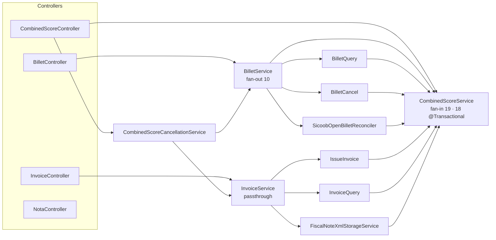
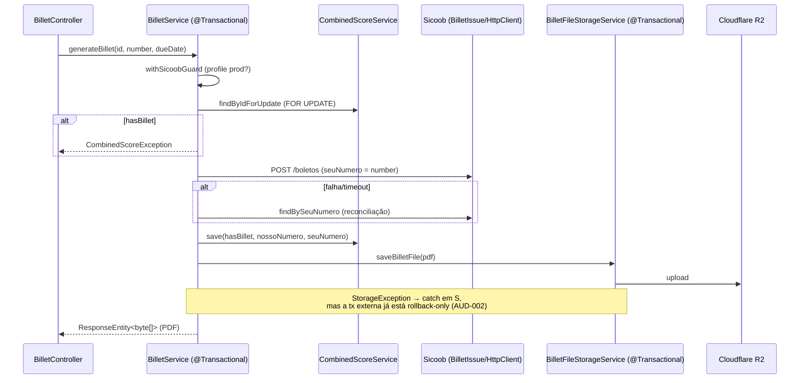

# Auditoria do Backend — Hortifruti SL

| Item | Valor |
| --- | --- |
| Data da auditoria | 2026-10-09 |
| Módulo auditado | `Codigo/Back` (Spring Boot 4.1.0 · Java 25) |
| Commit / branch | `4b9d735d` · `prod` |
| Natureza | Documental. Nenhum arquivo de produção, teste, configuração, migration ou dado foi alterado. |
| Local deste documento | `Codigo/Back/docs/auditoria-backend.md` — o repositório não tinha nenhum diretório `docs/`; o único diretório de documentação existente (`Documentacao/`, na raiz) guarda material acadêmico/PDF do projeto, não do módulo. Por isso `docs/` foi criado dentro do módulo auditado. Basta mover o arquivo se preferir outro local. |

> **Como ler os rótulos de certeza.** *Fato* = observado diretamente no código (com arquivo e linha). *Inferência* = consequência técnica deduzida de um fato + comportamento documentado do Spring/JDK/biblioteca. *Hipótese* = depende de algo que o repositório não prova (infraestrutura, dados de produção, uso real). Cada achado informa a confiança do diagnóstico separadamente.

---

## 1. Resumo executivo

### 1.1 Situação geral

O backend é um monólito Spring Boot de ~32 mil linhas de Java (445 classes em `src/main`, 9 classes de teste) que concentra: cadastro de clientes/compras, agrupamentos de cobrança (`CombinedScore`), emissão de boleto (Sicoob), emissão/cancelamento de NF-e (Focus NFe), extratos bancários (BB e Sicoob), relatórios fiscais, notificações (e-mail/WhatsApp), backup para Google Drive, extração de notas manuscritas via Gemini e autenticação própria (JWT em cookie + refresh token rotacionado + dispositivos vinculados).

O código é **majoritariamente legível, bem comentado e mostra maturidade em pontos difíceis** (idempotência de emissão por `ref`/`seuNumero` gerados localmente, `SELECT … FOR UPDATE` contra duplo clique, rotação de refresh token com janela de tolerância, tratamento centralizado de exceções com `DomainException`, guards de ambiente para integrações financeiras). Os problemas relevantes **não estão em "código feio"**, e sim em quatro famílias:

1. **Fronteiras transacionais que contradizem a intenção documentada** — comentários descrevem "best-effort" ou "transação própria", mas a semântica real do Spring (participação na transação externa, *rollback-only*, auto-invocação) faz o contrário. Isso atinge justamente os fluxos de dinheiro (boleto, NF-e, refresh token).
2. **Operações destrutivas ou fiscais com salvaguardas incompletas** — purga de dados após backup com CSV incompleto, *wipe* de catálogo na inicialização, relatório macro com período errado, compensação que cancela NF mesmo com boleto emitido.
3. **Superfície de segurança com buracos pontuais** — GETs com efeito colateral num cenário de cookie `SameSite=None` com CSRF desligado, callback OAuth público sem `state`, segredos em mensagens de exceção devolvidas ao cliente.
4. **Estrutura**: um serviço-hub (`CombinedScoreService`, fan-in 19, tocado em 39 de 196 commits desde jan/2026), fachadas que só repassam chamadas, e duplicação entre fluxos paralelos (BB × Sicoob, vários `isRejectedStatus`, 4 cópias de "período padrão").

### 1.2 Números

| Métrica | Valor | Fonte |
| --- | --- | --- |
| Java em `src/main` | ≈ 31,9 mil linhas · 445 arquivos | contagem direta |
| Camadas (linhas) | service 19.353 · config 3.888 · controller 2.404 · model 2.183 · dto 1.394 · exception 1.092 · repository 583 · util 260 · mapper 187 · tools 136 | contagem direta |
| Controllers / endpoints | 25 controllers · 130 mapeamentos HTTP | varredura |
| Chamadas de log | 212 (error 96 · warn 67 · info 47 · debug 2) · sem MDC/correlação | `grep` |
| `catch (Exception …)` | 121 · `throw new RuntimeException` 13 | `grep` |
| Linhas de comentário | ≈ 2,8 mil (8,7 % do total) | script |
| Testes | 9 classes · **51 testes · 0 falhas** (`mvn -o test`, 3,8 s) | execução |
| Dependências circulares (injeção por construtor) | **0** | grafo calculado |
| Achados | **48** (P0: 0 · P1: 11 · P2: 27 · P3: 10) | este documento |

### 1.3 Achados mais importantes (resumo)

| # | ID | Achado | Sev. |
| --- | --- | --- | --- |
| 1 | AUD-002 | Falha ao gravar o PDF do boleto no R2 desfaz, via *rollback-only*, o registro local de um boleto **já emitido** no Sicoob (convida a reemissão/duplicidade). | P1 |
| 2 | AUD-003 | Fluxo "NF + boleto" cancela a NF automaticamente mesmo quando o boleto **foi** emitido; mensagem afirma cancelamento sem confirmá-lo. | P1 |
| 3 | AUD-001 | Revogação em massa de refresh tokens por reuso é desfeita pelo próprio *rollback* da exceção — controle de segurança inerte. | P1 |
| 4 | AUD-004 | Cancelamento de boleto atualiza **todos** os agrupamentos com o mesmo `seuNumero` (documentado como não único), inclusive os já `PAGO`. | P1 |
| 5 | AUD-006 | "Backup" exporta CSV sem `combinedScoreId`/foto e depois **apaga** compras/transações/extratos do período, sem guarda de agrupamentos ativos. | P1 |
| 6 | AUD-007 | Inicialização apaga **todo** o catálogo climático se um produto tiver lista de meses vazia (permitida pela API). | P1 |
| 7 | AUD-005 | `POST /transactions/export-complete` aceita período, mas a parte bancária sempre usa o mês anterior. | P1 |
| 8 | AUD-016 / AUD-017 | GET com efeito colateral (emite boleto) + `SameSite=None` + CSRF off; callback OAuth público sem `state`. | P1 |
| 9 | AUD-018 | Token da UltraMsg (e chave do Google Maps) em URL de `RestTemplate`; mensagem da exceção volta no corpo da resposta e nos logs. | P1 |
| 10 | AUD-048 | Nenhum teste cobre autenticação, boleto, NF-e, extratos, backup, exceções ou controllers. | P1 |

**Nenhum achado P0 foi confirmado.** Os P1 acima são os mais próximos disso: dependem de uma condição de falha (R2 indisponível, colisão de `seuNumero`, período diferente do mês anterior) ou de um ator específico, e não de comportamento que ocorra em toda requisição.

### 1.4 O que está bem (e não deve ser "refatorado por refatorar")

- `GlobalExceptionHandler` + `DomainException` (um handler no lugar de ~25) — boa consolidação; faltam só os erros do próprio Spring MVC (AUD-025).
- Idempotência por identificador gerado localmente antes da chamada externa e reconciliação após timeout (`IssueInvoice#tryReconcileAfterIssueFailure`, `BilletService#tryReconcileAfterIssueFailure`) — decisão correta, bem documentada.
- Trava pessimista por agrupamento (`findByIdForUpdate`) em emissão de boleto/NF e em `hardDeleteLocally`.
- `CombinedScoreCancellationService`: documenta e implementa corretamente "cada etapa externa em transação própria; estado intermediário persiste".
- Camada de rede: *timeouts* explícitos, retry apenas em falha de rede (não em 4xx/5xx, para não duplicar emissão) na Focus NFe, redação da chave em `OpenWeatherClient`.
- Segurança de autenticação: BCrypt, lockout progressivo persistido, mensagem genérica contra enumeração, refresh token só com hash no banco, ticket de uso único para WebSocket, escopo mínimo (`ROLE_DEVICE_CAPTURE`) montado manualmente.
- Entidades usam `ZoneId` explícito em `@PrePersist/@PreUpdate`; `DueDateCalculator`/`BrazilianHolidays` são puros e testáveis.
- Sem ciclos de dependência; `open-in-view=false`; segredos fora do repositório (`.env` ignorado; `.env.example` completo para variáveis sem default).

---

## 2. Escopo e metodologia

### 2.1 O que foi examinado

Todo `Codigo/Back/src/main` (Java, `application*.properties`, migrations, templates), `src/test`, `pom.xml`, `Dockerfile`, `docker-compose.yml`, `railway.json`, `.env.example`, os READMEs por pacote e o histórico do Git (para co-alteração e para entender remoções). O frontend (`Codigo/Front`) foi **apenas pesquisado por texto** para classificar endpoints sem uso aparente.

Profundidade de leitura (detalhe na seção 18): ~70 arquivos lidos integralmente (controllers, filtros/segurança, serviços de billet/invoice/purchase/finance/notification/backup/realtime, exceptions), ~40 por trechos e o restante apenas por varredura automatizada (geradores de PDF/Excel, layouts de extrato, DTOs, mappers).

### 2.2 Procedimento

1. Inventário estrutural e métricas por arquivo (linhas, comentários, logs, `catch`, dependências).
2. Grafo de dependências por injeção de construtor (ciclos, fan-in/fan-out, violações de camada).
3. Leitura dos fluxos de maior risco, seguindo as chamadas até a persistência/integração.
4. Varreduras transversais: código sem referência (métodos, classes, campos, propriedades), `LocalDate.now()`, logs, `catch`, `@Transactional`, chamadas de endpoint no frontend.
5. Execução da suíte existente. 6. Análise de co-alteração no Git (`--since=2026-01-01`, 196 commits em `src/main/java`).

### 2.3 Ferramentas

`git`, `grep`, scripts Python ad hoc (somente leitura, em diretório temporário fora do repositório), `mvn -o test`. Nenhuma ferramenta foi instalada e nenhuma configuração foi alterada. O projeto **não tem** análise estática configurada (sem Checkstyle/PMD/SpotBugs/Sonar/JaCoCo/ArchUnit; Spotless existe mas sem execução vinculada ao build).

### 2.4 Limitações (resumo; completo na seção 18)

- A aplicação **não foi executada** (sem banco, sem credenciais de Sicoob/BB/Focus/R2/Gemini). Achados sobre *rollback-only*, auto-invocação e tratamento de exceções do MVC são **inferências a partir da semântica documentada do Spring**, não observações em runtime — cada um traz o teste que o confirmaria.
- Comportamento de produção (proxy Railway/Next, timezone do contêiner, dados reais, ids repetidos de `seuNumero`) não é verificável pelo repositório.
- Regras de negócio não foram presumidas: quando um comportamento parece intencional mas suspeito, ele está na seção 17.

---

## 3. Mapa do backend

### 3.1 Stack e topologia

| Aspecto | Observado |
| --- | --- |
| Runtime | Java 25, Spring Boot 4.1.0, Maven; imagem `eclipse-temurin:25-jre-jammy`, usuário não-root |
| Persistência | MySQL via JPA/Hibernate (`ddl-auto=update` em **todos** os perfis) + Flyway V1–V18 (`baseline-version=11`); Hikari `maximum-pool-size=10` |
| Auth | JWT HS256 (60 min) em cookie `HttpOnly` + refresh token opaco (30 dias, hash SHA-256 no banco) + `device_token` para celular vinculado; CSRF desabilitado; `SameSite=None; Secure` em hml/prod |
| Mensageria interna | `@Async` (executor padrão), WebSocket `/ws/realtime` com ticket de uso único |
| Armazenamento | Cloudflare R2 (S3 SDK): boletos, XML/DANFE, extratos, fotos, notas pendentes |
| Integrações | Sicoob (cobrança + extrato, mTLS), BB (extrato, mTLS), Focus NFe, Gemini, OpenWeather, Google Maps, UltraMsg (WhatsApp), SendGrid/Gmail SMTP/Gmail API, Google Drive |
| Deploy | Railway; healthcheck `/actuator/health`; **instância única** é premissa explícita em vários comentários (rate limit, blocklist, tickets, pareamento, `FiscalNoteRefLock` em memória) |
| Estado em memória | `TokenBlocklist`, `RateLimitingFilter.buckets`, `DeviceTokenAuthFilter.bucketsPorDispositivo`, `RefreshTokenService.recentRotations`, `DispositivoVinculadoService.codigosAtivos`, `RealtimeTicketService`, `FiscalNoteRefLock`, `InvoiceQuery.taxDetailsCache`, `SicoobToken`/`BBToken` |

### 3.2 Pacotes e responsabilidades

| Pacote | Conteúdo real | Observação |
| --- | --- | --- |
| `controller/*` | 25 `@RestController`, 2.404 linhas | Majoritariamente finos; exceções em AUD-037 |
| `service/purchase` | 24 classes + `tabelapreco/` (7) | Domínio central; `CombinedScoreService` é o hub |
| `service/billet` | 11 classes | Fachada `BilletService` + `BilletIssue/Cancel/Query` + reconciliador |
| `service/invoice` | 16 classes + `factory/` + `tax/` (relatórios PDF/XML) | `IssueInvoice`, `InvoiceQuery`, pollers, storage de XML/DANFE |
| `service/finance` | `bb/`, `sicoob/`, `transaction/`, `MacroExportService` | Dois importadores paralelos de extrato |
| `service/notification` | Coordinator, Notification, Bulk, `email/`, `whatsapp/` | |
| `service/backup`, `service/googleauth` | CSV + purga + OAuth Google | |
| `service/scheduler` | monitor/alerta de tamanho do banco | **Sem agendamento** (AUD-044) |
| `service/chatbot` | **somente um README** (módulo removido) | AUD-030 |
| `config/*` | segurança, clientes HTTP, mTLS, bootstrap (`UserInitializer`) | Contém **serviços de negócio** em `config/auth` (AUD-039) |
| `model`, `repository`, `dto`, `mapper`, `exception`, `util`, `tools` | | `tools/OrphanFiscalFileCleanupRunner` é runner pontual |

### 3.3 Dependências centrais (fan-in / fan-out por construtor)

Maiores fan-in: `CombinedScoreService` 19 · `FiscalProductRepository` 11 · `R2StorageService` 11 · `ClientRepository` 10 · `PurchaseRepository` 7. Maiores fan-out: `BilletService` 10 · `PurchaseService` 9 · `SicoobStatementService`/`BBStatementService` 8 · `IssueInvoice` 7 · `CombinedScoreService` 7 · `CapturaNotaPendenteService` 7.

Co-alteração (196 commits desde 2026-01-01): `CombinedScoreService` (39) · `IssueInvoice` (30) · `InvoiceController` (16) · `BilletHttpClient` (16). Pares que mudam juntos: `CombinedScoreRepository`+`CombinedScoreService` (11), `CombinedScoreService`+`IssueInvoice` (10), `InvoiceController`+`InvoiceService` (9), `BilletHttpClient`+`SicoobToken` (8), `InvoiceService`+`IssueInvoice` (7).

---

## 4. Fluxos funcionais analisados

### F1 — Login, sessão e refresh

1. **Entrada:** `POST /auth` → `AuthController.login` (`AuthController.java:58-77`).
2. **Validação:** `@Valid AuthRequest`; `Auth.autenticar` consulta lockout por conta e por IP (`LoginProtectionService.assertNotLocked`), carrega `User`, compara BCrypt.
3. **Efeitos:** `registerSuccess`/`registerFailure` (transações próprias, auditoria em `login_audit_log`, e-mail de alerta ao bloquear), emissão de JWT e de refresh token (persistido com hash).
4. **Resposta:** dois `Set-Cookie` (`auth_token` path `/`, `refresh_token` path `/api/auth`) + `AuthUserResponse`.
5. **Refresh:** `POST /auth/refresh` → `RefreshTokenService.rotate` (`@Transactional`, `SELECT … FOR UPDATE` do token). Reuso de token revogado → tenta janela de 10 s em memória; fora dela, `revokeAllActiveByUserId` + `TokenException` → **ver AUD-001**.
6. **Erros:** `TokenException` → 401 e cookies limpos. Falha de banco no filtro → 503 (`SecurityFilter.java:121-137`).
7. **Testes:** nenhum.

### F2 — Emissão de boleto (`GET /billet/generate/{id}`)

- **Validações:** `hasBillet` sob lock; `dueDate` opcional (`LocalDate.parse` dentro de `try` → falha de parse vira "Erro ao gerar o boleto").
- **Externos:** Sicoob (token OAuth2 em cache `synchronized`, retry único em 401), R2.
- **Transação:** única, aberta no `BilletService`, **abrange a chamada HTTP ao Sicoob e o upload ao R2** (AUD-012).
- **Resposta:** o próprio PDF; o serviço devolve `ResponseEntity` (AUD-032).
- **Em ambiente ≠ `prod`:** devolve PDF vazio com HTTP 200 sem tocar o Sicoob (AUD-015).
- **Testes:** nenhum.

### F3 — NF-e + boleto (`POST /invoices/issue-with-billet/{id}`)

1. `IssueInvoiceWithBilletService.issueInvoiceAndBilletAsync` (`@Async`) → `InvoiceService.issueInvoice` → `IssueInvoice.issueInvoice` (`@Transactional`, `FOR UPDATE`, UUID como `ref`, POST à Focus NFe, reconciliação por `ref`, marca `hasInvoice`).
2. `triggerSaveAfterIssuance` dispara o poller assíncrono (até 36 × 10 s) que baixa XML/DANFE para o R2.
3. `waitForInvoiceNumber`: até 12 × 10 s de `Thread.sleep` consultando a NF.
4. Baixa DANFE e XML (`DanfeXmlService`, com retries e `sleep`), chama `BilletService.generateBillet` (F2).
5. Qualquer exceção → `rollbackInvoice` (cancela a NF) → **AUD-003**.
6. **Resposta:** NF + XML + boleto em Base64 no corpo; `spring.mvc.async.request-timeout=180000`.

### F4 — Cancelamento de agrupamento (`DELETE /combined-scores/{id}`)

`CombinedScoreCancellationService.cancelGrouping`: bloqueia se `PAGO`; cancela NF (`InvoiceService.cancelInvoice`, extemporâneo fixo), relê o estado, baixa boleto (`BilletService.cancelBillet`), e só então `hardDeleteLocally` (transacional, remove arquivos no R2, desvincula compras). Resposta de cancelamento "PROCESSANDO" da NF **não é inspecionada** (AUD-013).

### F5 — Criação de agrupamento (`POST /combined-scores/create`)

`CombinedScoreService.createCombinedScore` (`@Transactional`): valida período, busca compras do cliente no intervalo, recusa compras já agrupadas, agrupa itens (`GroupedProductService`: preço fixo × médio ponderado), calcula vencimento (`DueDateCalculator` + `ClientBusinessRules`), persiste, vincula compras (`combinedScoreId`) e gera o PDF de fotos (`CombinedScorePhotoService`, I/O no R2 **dentro** da transação — AUD-010). Sem lock nas compras: duas requisições simultâneas podem agrupar as mesmas compras (verificação *check-then-act*).

### F6 — Captura de nota por celular → compra

`POST /api/compras/notas/capturas` (celular, `device_token`) → valida magic bytes (JPEG/PNG, ≤10 MB) → upload R2 → `CapturaNotaPendente(RECEBIDA)` → `@Async` Gemini (até 3 tentativas HTTP × 3 de "qualidade") → enriquecimento (matching de produto/cliente, conversão caixa→kg, preço oficial) → `PRONTA` → push WebSocket. O PC revisa e chama `POST /pendentes/{id}/confirmar` → `PurchaseService.createManualPurchase` (AUD-009).

### F7 — Extratos e relatório macro

- **Importação API (BB/Sicoob):** guard de ambiente → período → reaproveita o **último** `Statement` da API do banco → busca → gera PDF → `upload` no **mesmo** `objectKey` → grava `Statement` → filtra duplicatas por hash → persiste. BB compensa falha com `rollbackStatement`; Sicoob não (AUD-008).
- **Relatório macro:** `MacroExportService` junta `TransactionExportService.exportTransactionsAsZip()` (sem parâmetro de período) com `ReportTaxService.generateMonthlyFiles(start, end)` → AUD-005.

### F8 — Backup com purga (`POST /backup`)

`BackupService.performBackupForPeriod`: gera 4 CSVs → envia ao Drive → **apaga** itens de compra, compras, transações e extratos do período por `createdAt` (`EntityCleanupService`, `@Transactional`). Se não há autorização OAuth, devolve o link no corpo (prefixo de mensagem de exceção `AUTHORIZATION_REQUIRED:`) → AUD-006, AUD-017, AUD-026.

### F9 — Pareamento de dispositivo / tempo real

Código de 6 dígitos em memória (TTL 5 min, uso único) → `device_token` opaco (hash no banco, cookie `HttpOnly`) → `DeviceTokenAuthFilter` concede somente `ROLE_DEVICE_CAPTURE`, limite 15 req/min/dispositivo. WebSocket: ticket de 15 s trocado no handshake. Desenho coerente; ressalvas em AUD-020 e AUD-024.

---

## 5. Inventário de achados

### 5.1 Índice

Legenda de confiança: **A** alta · **M** média · **B** baixa. "Tipo": **F** = fato observado · **I** = inferência da semântica do framework · **H** = hipótese dependente de ambiente.

| ID | Título | Sev. | Conf. | Tipo | Grupo |
| --- | --- | --- | --- | --- | --- |
| AUD-001 | Revogação em massa de refresh tokens desfeita por *rollback* | P1 | A | I | A. Consistência |
| AUD-002 | Falha no R2 desfaz o registro de boleto já emitido (*rollback-only*) | P1 | A | I | A |
| AUD-003 | Compensação NF+boleto cancela NF com boleto emitido e afirma sucesso não verificado | P1 | A | F | A |
| AUD-004 | Cancelamento de boleto altera todos os agrupamentos com o mesmo `seuNumero` | P1 | M | F/H | A |
| AUD-005 | Relatório macro ignora o período nos relatórios bancários | P1 | A | F | A |
| AUD-006 | Backup incompleto seguido de purga sem guarda de agrupamentos | P1 | A | F | A |
| AUD-007 | Inicialização apaga todo o catálogo climático | P1 | A | F | A |
| AUD-008 | Importação de extrato: Sicoob sem compensação; PDF anterior sobrescrito | P2 | A | F | A |
| AUD-009 | Confirmação de captura não idempotente; captura presa em `EXTRAINDO` | P2 | M | F | A |
| AUD-010 | Geração do PDF de fotos não é *best-effort* e roda dentro da transação | P2 | A | I | A |
| AUD-011 | `@Transactional(REQUIRES_NEW)` anulado por auto-invocação | P2 | A | I | A |
| AUD-012 | Conexões de banco presas durante I/O externo e `sleep` | P2 | M | F/H | A |
| AUD-013 | Cancelamento de agrupamento ignora o status "PROCESSANDO" da NF | P2 | M | F | A |
| AUD-014 | Compras agrupadas podem ser alteradas/removidas; preço oficial inconsistente | P2 | A | F | A |
| AUD-015 | "Boleto cancelado com sucesso" com 409 e em ambiente bloqueado | P2 | A | F | A |
| AUD-016 | GET com efeito colateral + `SameSite=None` + CSRF desabilitado | P1 | M | F/H | B. Segurança |
| AUD-017 | Callback OAuth do Google público e sem `state` | P1 | M | F/H | B |
| AUD-018 | Segredos em URL de `RestTemplate` vazam em mensagem/log de exceção | P1 | M | I | B |
| AUD-019 | Senha temporária do bootstrap escrita em `System.out` | P2 | A | F | B |
| AUD-020 | IP do cliente = último `X-Forwarded-For` (lockout/rate limit compartilhados) | P2 | B | H | B |
| AUD-021 | Troca de senha sem senha atual; política 4 × 8; exclusão sem guardas | P2 | A | F | B |
| AUD-022 | Perfil padrão `local` com `root/root`; `ddl-auto=update` em produção | P2 | M | F | B |
| AUD-023 | Autorização de operações fiscais/destrutivas só pelo *catch-all* | P2 | B | H | B |
| AUD-024 | `DeviceTokenAuthFilter` mascara falha de banco; três formatos de erro | P2 | A | F | B |
| AUD-025 | *Catch-all* converte erros 4xx do Spring MVC em 500 | P2 | A | I | C. Erros/logs |
| AUD-026 | Controle de fluxo por texto de mensagem de exceção | P2 | A | F | C |
| AUD-027 | Camadas `Billet*` re-embrulham exceções e perdem o detalhe do Sicoob | P2 | A | F | C |
| AUD-028 | Falhas parciais engolidas em relatórios; fallback para "agora"; cache sem invalidação | P2 | A | F | C |
| AUD-029 | Logs: sem correlação, PII, níveis e mensagens | P3 | A | F | C |
| AUD-030 | Comentários que contradizem o código e documentação obsoleta | P3 | A | F | C |
| AUD-031 | `CombinedScoreService` como hub de leitura/escrita de todos os domínios | P2 | A | F | D. Estrutura |
| AUD-032 | Fachadas que só repassam; `ResponseEntity` em serviços; `@Transactional` redundante | P2 | A | F | D |
| AUD-033 | Duplicação entre fluxos paralelos | P2 | A | F | D |
| AUD-034 | Regras de negócio e valores com vigência codificados em Java | P2 | A | F | D |
| AUD-035 | `UserInitializer` mistura bootstrap de infra, usuários e seed de dados | P3 | A | F | D |
| AUD-036 | `GeminiExtractionService`: cliente de IA + domínio; retries multiplicativos | P2 | A | F | D |
| AUD-037 | Controllers: lógica, entidade exposta, prefixos e utilitários repetidos | P3 | A | F | D |
| AUD-038 | Catálogo fiscal com duas fontes de verdade | P2 | A | F | D |
| AUD-039 | Serviços de negócio em `config/auth`; acesso a repositório por atalho | P3 | A | F | D |
| AUD-040 | Consultas repetidas / N+1 / agregação em memória | P2 | A | F | E. Eficiência |
| AUD-041 | Validação de entrada incompleta (`@Valid`, paginação, `PATCH` com nulos) | P3 | A | F | E |
| AUD-042 | `LocalDate.now()` sem fuso em contêiner sem TZ configurada | P3 | M | H | E |
| AUD-043 | Código morto confirmado e candidatos | P3 | A | F | F. Morto/obsoleto |
| AUD-044 | Alerta de armazenamento do banco sem agendamento; limites divergentes | P2 | A | F | F |
| AUD-045 | Propriedades de configuração sem uso | P3 | A | F | F |
| AUD-046 | Envio em massa à contabilidade ignora lista de e-mails e usa e-mail como WhatsApp | P2 | A | F | F |
| AUD-047 | Arquivos temporários, `Files.walk` sem fechamento, upload de nota sem consumidor | P3 | A | F | F |
| AUD-048 | Cobertura de testes não protege os fluxos críticos | P1 | A | F | G. Testes |

### 5.2 Grupo A — Consistência transacional e integridade de fluxos financeiros/fiscais

#### AUD-001 — Revogação em massa de refresh tokens desfeita por *rollback*

- **ID:** AUD-001
- **Título:** Reuso de refresh token detectado, mas a revogação de todas as sessões não é confirmada no banco.
- **Gravidade:** P1
- **Confiança do diagnóstico:** alta (semântica padrão de `@Transactional`; não executado em runtime).
- **Localização:** `config/auth/RefreshTokenService.java` — `rotate` (72-99), `handleAlreadyRevoked` (106-118; `revokeAllActiveByUserId` na 116, `throw` na 117); `repository/RefreshTokenRepository.java:29-33`; `controller/user/AuthController.java:89-121`.
- **Evidência:** `rotate` é `@Transactional` (import `org.springframework.transaction.annotation`). `handleAlreadyRevoked` executa um `UPDATE … SET revoked_at` (`@Modifying`) e, na linha seguinte, lança `TokenException`, que estende `DomainException` → `RuntimeException`. O Javadoc da classe (18-30) afirma que o reuso "aciona a revogação de todas as sessões ativas do usuário".
- **Comportamento atual:** fora da janela de tolerância de 10 s, o reuso de um token revogado devolve 401 e limpa cookies. Pelo comportamento padrão (RuntimeException ⇒ *rollback*), o `UPDATE` executado na mesma transação **não é confirmado**.
- **Problema:** o controle de defesa descrito no código não persiste.
- **Impacto:** quem roubou um refresh token e já o rotacionou mantém a sessão nova válida por até 30 dias, mesmo depois de a vítima reapresentar o token antigo.
- **Causa provável:** a exceção é usada tanto para sinalizar erro ao chamador quanto, indiretamente, para "abortar" o método que também contém o efeito que deveria persistir.
- **Correção recomendada:** persistir a revogação em transação independente (método em outro bean com `REQUIRES_NEW`, ou `noRollbackFor = TokenException.class` no `rotate` com a exceção lançada após o commit). Não alterar a janela de 10 s nem a mensagem.
- **Comportamento a preservar:** 401 + `Set-Cookie` de limpeza (`clearedCookiesResponse`); janela de tolerância; trava `PESSIMISTIC_WRITE`; mensagem genérica `INVALID_TOKEN_MESSAGE`; refresh concorrente legítimo não revoga nada.
- **Testes necessários:** *antes* — teste de caracterização com JPA real (H2 ou MySQL em contêiner) emitindo T1→T2 e reapresentando T1 após a janela, hoje deve **falhar** a asserção "T2 revogado" (confirma o diagnóstico); *depois* — mesma asserção passa; caso concorrente dentro da janela continua devolvendo o token novo.
- **Risco da correção:** baixo-médio (muda quando o commit ocorre; cuidar para não revogar em corrida legítima).
- **Esforço estimado:** pequeno — alteração localizada em uma classe; o custo maior é montar o teste de integração (AUD-048).
- **Dependências:** infraestrutura de teste de integração (AUD-048).
- **Critério de conclusão:** após reuso fora da janela, `SELECT COUNT(*) FROM refresh_tokens WHERE user_id=? AND revoked_at IS NULL` = 0 no teste; suíte existente verde.

#### AUD-002 — Falha no R2 desfaz o registro de boleto já emitido

- **ID:** AUD-002
- **Título:** `generateBillet` perde `hasBillet=true` quando o armazenamento do PDF falha.
- **Gravidade:** P1
- **Confiança do diagnóstico:** alta (inferência da propagação REQUIRED; ver AUD-048 para o teste que confirma).
- **Localização:** `service/billet/BilletService.java` — `generateBillet` (212-296; `try/catch` do armazenamento em 284-293); `service/storage/BilletFileStorageService.java` — `saveBilletFile` (31-52); `service/storage/R2StorageService.java` — `upload` (30-40).
- **Evidência:** `generateBillet` é `@Transactional` (212). `saveBilletFile` também é `@Transactional` (31, propagação padrão) e chama `r2StorageService.upload`, que lança `StorageException` (`DomainException`, 500) em `S3Exception|SdkClientException` (R2StorageService:36-38). O `catch (Exception storageError)` (286) só faz `log.warn("… não afeta a emissão …")`. O comentário nas linhas 262-265 declara a intenção de que falhas pós-emissão **não** desfaçam o registro.
- **Comportamento atual:** a exceção sai do proxy transacional de `saveBilletFile` e marca a transação **compartilhada** como *rollback-only*; ao concluir `generateBillet`, o commit falha com `UnexpectedRollbackException` (tratada pelo catch-all como 500), descartando `hasBillet`, `ourNumberSicoob`, `yourNumber` e a eventual troca de `dueDate`. O boleto permanece emitido no Sicoob.
- **Problema:** efeito oposto ao descrito no próprio código; invariante "boleto existe no Sicoob ⇒ existe localmente" violada.
- **Impacto:** o usuário vê erro e tenta de novo (o `FOR UPDATE` já não protege, pois `hasBillet` voltou a `false`); o Sicoob recebe novo POST com o mesmo `seuNumero`. No fluxo F3, a falha dispara AUD-003.
- **Causa provável:** colaborador transacional chamado dentro de transação maior com o erro engolido pelo chamador; I/O externo dentro da transação (AUD-012).
- **Correção recomendada:** salvar o PDF **após o commit** (mesmo padrão já usado em `cancelBilletFileAfterCommit`) ou em `REQUIRES_NEW` capturando falha; o PDF continua sendo devolvido na resposta.
- **Comportamento a preservar:** `FOR UPDATE`; reconciliação por `seuNumero`; mensagem "NÃO gere outro boleto" (linhas 275-281); idempotência do arquivo ativo; resposta com o PDF mesmo se o armazenamento falhar; `GET /billet/{id}/file` com 404 quando não houver arquivo.
- **Testes necessários:** *antes* — teste com `PlatformTransactionManager` real, `BilletIssue` stubado e `BilletFileStorageService` lançando `StorageException`; hoje esperar `UnexpectedRollbackException`. *depois* — retorna PDF, `hasBillet=true` persistido, PDF ausente tratável via 2ª via.
- **Risco da correção:** médio (altera a ordem de efeitos; o PDF pode não existir imediatamente após a resposta).
- **Esforço estimado:** pequeno-médio.
- **Dependências:** AUD-048; relacionado a AUD-012 e AUD-003.
- **Critério de conclusão:** com R2 simulado indisponível, a chamada retorna 200 e o agrupamento fica `hasBillet=true`; o log registra a falha de armazenamento sem `UnexpectedRollbackException`.

#### AUD-003 — Compensação NF+boleto cancela NF com boleto emitido

- **ID:** AUD-003
- **Título:** `issueInvoiceAndBillet` cancela a NF-e em qualquer falha e afirma o cancelamento sem verificá-lo.
- **Gravidade:** P1
- **Confiança do diagnóstico:** alta (fato no código; efeito depende da ocorrência da falha).
- **Localização:** `service/invoice/IssueInvoiceWithBilletService.java` — `issueInvoiceAndBillet` (55-95), `rollbackInvoice` (97-107); `service/billet/BilletService.java:266-282`.
- **Evidência:** o `catch (Exception e)` (81) cobre `waitForInvoiceNumber`, os downloads e `billetService.generateBillet`. Ele chama `rollbackInvoice(ref)` — que usa `cancelInvoice(ref, justificativa)` (modo **não** extemporâneo) e **engole** qualquer falha (101-106) — e depois lança `InvoiceException("… A nota fiscal emitida foi cancelada automaticamente …")` incondicionalmente (89-93). `BilletService` lança `CombinedScoreException("O boleto FOI emitido … NÃO gere outro boleto …")` quando o boleto foi emitido mas não registrado (275-281); essa exceção cai no mesmo `catch`.
- **Comportamento atual:** (a) boleto emitido + falha local de registro ⇒ NF cancelada e boleto órfão; (b) cancelamento impossível (prazo, NF ainda "processando_autorizacao") ⇒ NF segue ativa, mas a resposta diz que foi cancelada.
- **Problema:** compensação sem distinguir os estados "boleto não emitido" e "boleto emitido"; mensagem de sucesso não verificada.
- **Impacto:** cancelamento irreversível de documento fiscal válido; ou NF ativa sem cobrança vinculada descrita como cancelada.
- **Causa provável:** tratar o fluxo como saga com uma única compensação ("desfazer a NF").
- **Correção recomendada:** (1) não compensar quando a falha for "boleto emitido e não registrado"; (2) devolver o resultado real do cancelamento (`CANCELADO`, `PROCESSANDO`, `FALHOU — ação manual`) na mensagem/campo do erro.
- **Comportamento a preservar:** rollback automático quando o boleto realmente não foi emitido; justificativa registrada na Sefaz; status HTTP de erro e corpo de erro padrão.
- **Testes necessários:** unitário com `InvoiceService`/`BilletService` mockados nos 4 cenários (falha antes da emissão; falha ao registrar; cancelamento OK; cancelamento falha) — hoje os cenários 2 e 4 demonstram o problema.
- **Risco da correção:** baixo (lógica local).
- **Esforço estimado:** pequeno.
- **Dependências:** AUD-002 reduz a frequência do cenário (a); AUD-013 trata o status "PROCESSANDO".
- **Critério de conclusão:** nenhum cenário de teste cancela NF com boleto emitido; mensagem espelha o resultado de `cancelInvoice`.

#### AUD-004 — Cancelamento de boleto altera todos os agrupamentos com o mesmo `seuNumero`

- **ID:** AUD-004
- **Título:** escrita de status por chave de negócio não única (`yourNumber`).
- **Gravidade:** P1
- **Confiança do diagnóstico:** média (o código é um fato; a existência de duplicatas em produção é hipótese — ver Q-04).
- **Localização:** `service/purchase/CombinedScoreService.java` — `updateStatusAfterBilletCancellation` (282-300); `service/billet/BilletCancel.java` — `updateLocalRecordsBestEffort` (101-113), `handleCancelResponse` (133-141); `repository/purchase/CombinedScoreRepository.java:57-63`.
- **Evidência:** o repositório documenta: "*yourNumber (seuNumero) não é único: agrupamentos diferentes podem acabar com o mesmo número (ex.: reemissão de boleto sem limpar o valor antigo)*". O método chama `findAllByYourNumber`, itera **todos** e define `CANCELADO`/`CANCELADO_BOLETO` + `hasBillet=false`, sem excluir `PAGO`. O parâmetro chama-se `nossoNumero` mas recebe `getYourNumber()` (BilletCancel:111, 136).
- **Comportamento atual:** cancelar o boleto de um agrupamento atualiza também qualquer outro com o mesmo `seuNumero`.
- **Problema:** escrita em lote por chave ambígua; nome de parâmetro enganoso; o cancelamento não limpa `yourNumber`/`ourNumberSicoob`, o que alimenta as colisões na reemissão.
- **Impacto:** agrupamento `PAGO` revertido para `CANCELADO`; contas a receber e dashboard divergem do Sicoob.
- **Causa provável:** o `seuNumero` é digitado/derivado do número da NF (`number`), que pode ser reutilizado após cancelamento.
- **Correção recomendada:** atualizar por **id** do agrupamento (já disponível em `BilletCancel.cancelBillet`); para a baixa avulsa, localizar por `ourNumberSicoob` e ignorar `PAGO`; tratar duplicatas legadas em passo separado (consulta de contagem prévia).
- **Comportamento a preservar:** regra `hasInvoice ? CANCELADO_BOLETO : CANCELADO`; `hasBillet=false`; remoção do arquivo no R2 após commit.
- **Testes necessários:** dois agrupamentos com o mesmo `yourNumber`, um `PAGO`; cancelar o outro ⇒ o `PAGO` permanece (hoje falha).
- **Risco da correção:** médio (dados legados; comportamento da baixa avulsa).
- **Esforço estimado:** pequeno.
- **Dependências:** Q-04 (verificar duplicatas); AUD-048.
- **Critério de conclusão:** teste acima verde; consulta de duplicatas executada e registrada.

#### AUD-005 — Relatório macro ignora o período nos relatórios bancários

- **ID:** AUD-005
- **Título:** `POST /transactions/export-complete` mistura períodos.
- **Gravidade:** P1
- **Confiança do diagnóstico:** alta.
- **Localização:** `service/finance/MacroExportService.java` — `exportMacroReports` (29-37), `generateTransactionReports` (115-117), `generateTaxReports` (141-145); `service/finance/transaction/TransactionExportService.java:33-37`; `controller/finance/TransactionController.java:126-142`.
- **Evidência:** o controller aceita `startDate`/`endDate`; `MacroExportService` os usa para a pasta e para `reportTaxService.generateMonthlyFiles(start, end)`, mas chama `transactionExportService.exportTransactionsAsZip()` **sem argumentos**, que calcula `now.minusMonths(1).withDayOfMonth(1)` … `now.withDayOfMonth(1).minusDays(1)`.
- **Comportamento atual:** com período explícito diferente do mês anterior, o ZIP traz relatórios fiscais do período pedido e relatórios/extratos bancários do mês anterior, sob pasta nomeada pelo mês pedido. Sem erro nem aviso.
- **Problema:** parâmetro aceito e ignorado em metade do resultado.
- **Impacto:** entrega contábil com dados de mês errado, difícil de perceber.
- **Causa provável:** `exportTransactionsAsZip` nasceu para o fluxo mensal automático e foi reutilizada.
- **Correção recomendada:** adicionar `(LocalDate inicio, LocalDate fim)` a `exportTransactionsAsZip` e repassar o período resolvido; manter o mesmo default quando ausentes.
- **Comportamento a preservar:** nomes de arquivo e estrutura de pastas; default = mês anterior completo; mensagem/aviso quando relatórios fiscais falham (AUD-028).
- **Testes necessários:** `MacroExportService` com `TransactionExportService`/`ReportTaxService` fakes: período arbitrário ⇒ ambos recebem o mesmo intervalo.
- **Risco da correção:** baixo (mudança funcional pequena e explícita: passa a respeitar o parâmetro).
- **Esforço estimado:** pequeno.
- **Dependências:** AUD-033 (consolidar `resolvePeriodo`).
- **Critério de conclusão:** teste verde; ZIP de período arbitrário contém apenas lançamentos do período.

#### AUD-006 — Backup incompleto seguido de purga

- **ID:** AUD-006
- **Título:** `POST /backup` apaga dados cujo CSV não preserva vínculos e sem guarda de agrupamentos ativos.
- **Gravidade:** P1
- **Confiança do diagnóstico:** alta (fato); a gravidade assume uso real da purga.
- **Localização:** `service/backup/BackupService.java:29-62`; `service/backup/CsvGeneratorService.java` — compras (51-84; cabeçalho 59-64), itens (86-135; `findAll` em 97), transações (137-…); `service/backup/EntityCleanupService.java:22-37`; `service/purchase/PurchaseService.java:224-227`; `service/purchase/InvoiceProductService.java:55-58`.
- **Evidência:** o CSV de compras exporta `ID, Cliente ID, Data, Total, Criado, Atualizado` — **sem** `combinedScoreId` nem `imagemR2Key`. O CSV de itens usa `invoiceProductService.findAll()` (todos os itens do banco, não do período) enquanto a exclusão é `deleteByCreatedAtBetween`. Após o upload, `cleanupEntitiesForPeriod` apaga itens, compras, transações e extratos do período por `createdAt`; não há verificação de agrupamentos ativos (`combinedScoreId != null`) nem tratamento dos objetos no R2 (fotos, PDFs de extrato).
- **Comportamento atual:** "backup" é na prática "exportar e apagar".
- **Problema:** o artefato de backup não permite reconstruir o estado e a purga pode atingir compras que sustentam agrupamentos/boletos/NF em aberto.
- **Impacto:** perda de rastreabilidade compra↔agrupamento↔foto; objetos órfãos no bucket; `GroupedProduct`/`CombinedScore` sem origem.
- **Causa provável:** o backup foi pensado para liberar espaço no banco (alerta de 80 % do MySQL) sem modelar dependências posteriores.
- **Correção recomendada (em etapas):** (1) completar colunas dos CSVs e filtrar itens por período (corrige o artefato sem mudar a purga); (2) impedir purga de compras vinculadas a agrupamento não encerrado — **mudança funcional** a documentar; (3) oferecer *dry-run*/contagem antes de apagar.
- **Comportamento a preservar:** nomes/colunas atuais (novas colunas ao final), pasta no Drive, fluxo de autorização, resposta de sucesso.
- **Testes necessários:** `CsvGeneratorService` com entidades completas (todas as colunas e filtro por período); `EntityCleanupService` com compra agrupada.
- **Risco da correção:** médio (fluxo operacional manual do gerente).
- **Esforço estimado:** médio.
- **Dependências:** AUD-017 (OAuth), AUD-044 (alerta de espaço), AUD-048; Q-02.
- **Critério de conclusão:** CSV restaurável (colunas completas) e purga bloqueada/avisada para compras agrupadas, conforme decisão de Q-02.

#### AUD-007 — Inicialização apaga todo o catálogo climático

- **ID:** AUD-007
- **Título:** `repopulateProductsIfNeeded` executa `deleteAllInBatch()` a cada start se um produto tiver lista vazia.
- **Gravidade:** P1
- **Confiança do diagnóstico:** alta.
- **Localização:** `config/UserInitializer.java:48-65` (`repopulateProductsIfNeeded`), `98-345` (`createSampleProducts`); `dto/climate/ProductRequest.java` (construtor compacto); `controller/climate/ProductController.java:111-144`.
- **Evidência:** se **qualquer** `ClimateProduct` tem `peakSalesMonths` nulo/vazio (linha 53), o runner apaga todos os produtos e recria a lista fixa (61-62). `ProductRequest` converte `null` em `List.of()` e não valida; a API permite criar/editar produtos (MANAGER).
- **Comportamento atual:** um produto salvo sem meses de pico provoca, no próximo restart/deploy, a exclusão de todos os produtos personalizados.
- **Problema:** operação destrutiva automática em produção, sem log do que foi removido.
- **Impacto:** perda do catálogo usado nas recomendações climáticas; recomendação passa a ser a lista de exemplo.
- **Causa provável:** rotina de "reparo" de dados corrompidos do passado (log: "dados corrompidos?") mantida como comportamento permanente.
- **Correção recomendada:** remover a repopulação destrutiva (a tabela vazia já é semeada em 89-95) e, se vazio não for permitido, validar na API (mudança funcional separada).
- **Comportamento a preservar:** seed quando a tabela está vazia; criação do admin/usuários iniciais.
- **Testes necessários:** `UserInitializer` com repositório fake contendo produto de lista vazia ⇒ nenhuma chamada a `deleteAllInBatch`.
- **Risco da correção:** baixo.
- **Esforço estimado:** pequeno.
- **Dependências:** Q-05.
- **Critério de conclusão:** nenhuma exclusão em massa durante a inicialização; teste verde.

#### AUD-008 — Importação de extrato: Sicoob sem compensação; PDF anterior sobrescrito

- **ID:** AUD-008
- **Título:** dois importadores com a mesma sequência e tratamento de falha diferente.
- **Gravidade:** P2
- **Confiança do diagnóstico:** alta.
- **Localização:** `service/finance/sicoob/SicoobStatementService.java:54-139` (statement salvo em 108; transações 110-120); `service/finance/bb/BBStatementService.java:68-158` (compensação 134-139, 160-178); `service/finance/transaction/TransactionImportPersistenceService.java:30-61`.
- **Evidência:** o BB documenta (135-137) o defeito "statement ficaria gravado com o período e a próxima tentativa cairia em 'já processado' (falso sucesso, 0 lançamentos)" e compensa em `rollbackStatement`. O Sicoob repete a mesma sequência sem essa compensação. Ambos reutilizam o último `Statement` da API do banco e escrevem o PDF no **mesmo** `objectKey` antes de gravar o banco (BB 104-109; Sicoob 86-91); `rollbackStatement` restaura nome/período mas não o PDF. `saveTransactionsIndividually` lança no primeiro erro, deixando as anteriores persistidas.
- **Comportamento atual:** falha no Sicoob "trava" o período; em ambos, o PDF do período anterior é substituído.
- **Problema:** correção aplicada em um fluxo e não no gêmeo; sobrescrita irrecuperável.
- **Impacto:** reimportar o mesmo período retorna "já processado" com 0 lançamentos (Sicoob); histórico de PDFs por período se perde.
- **Causa provável:** duplicação (AUD-033).
- **Correção recomendada:** extrair o fluxo comum com compensação única; gravar o PDF em chave nova e só então apontar o `Statement`.
- **Comportamento a preservar:** deduplicação por hash; resumo (`*ImportSummary`); mensagem de "já processado"; guards de ambiente.
- **Testes necessários:** importador com persistência falhando ⇒ novo import do mesmo período reprocessa.
- **Risco da correção:** médio (chaves de R2; consultas de extrato dependem do `objectKey`).
- **Esforço estimado:** médio.
- **Dependências:** AUD-033; Q-06 (um `Statement` por banco/origem é intencional?).
- **Critério de conclusão:** teste de falha verde para BB e Sicoob; PDF anterior preservado.

#### AUD-009 — Confirmação de captura não idempotente; captura presa

- **ID:** AUD-009
- **Título:** `confirmarComoCompra` não verifica o estado; `EXTRAINDO` não tem recuperação.
- **Gravidade:** P2
- **Confiança do diagnóstico:** média.
- **Localização:** `service/purchase/CapturaNotaPendenteService.java` — `confirmarComoCompra` (110-132), `descartar` (153-163), `reprocessar` (172-184); `service/purchase/CapturaExtracaoAsyncService.java:36-90`.
- **Evidência:** `confirmarComoCompra` busca por `id`+`usuarioId` e cria a compra **sem checar `status`** (113-119); `descartar` também não checa. `reprocessar` só aceita `ERRO` (179), mas `EXTRAINDO` fica persistido se a JVM reiniciar durante o `@Async`, e `STATUS_PENDENTES` (42-47) o mantém na fila sem saída. `r2StorageService.delete` (125) roda dentro da transação; `StorageException` desfaz a compra.
- **Comportamento atual:** qualquer captura do usuário pode ser confirmada/descartada em qualquer estado; uma captura interrompida em `EXTRAINDO` permanece indefinidamente na fila sem ação possível.
- **Problema:** transições de estado sem pré-condição; ausência de recuperação para execução assíncrona interrompida; efeito externo (R2) dentro da transação de negócio.
- **Impacto:** duplo clique/retry cria compra duplicada (receita inflada em agrupamento/NF); captura "presa"; erro de limpeza do bucket impede a confirmação.
- **Causa provável:** o estado foi modelado como "rótulo de tela", sem máquina de estados explícita.
- **Correção recomendada:** exigir `PRONTA` para confirmar e fazer a transição de forma atômica (`UPDATE … WHERE status = 'PRONTA'`); mover a limpeza do R2 para `afterCommit` *best-effort*; job simples que devolve `EXTRAINDO` antigo para `ERRO`.
- **Comportamento a preservar:** retorno `PurchaseResponse`; regra de foto compartilhada entre notas irmãs (`podeApagarFotoDoR2`); `reprocessar` só para `ERRO`.
- **Testes necessários:** confirmar duas vezes ⇒ segunda recusada; `StorageException` na limpeza ⇒ compra persiste.
- **Risco da correção:** baixo.
- **Esforço estimado:** pequeno-médio.
- **Dependências:** AUD-048.
- **Critério de conclusão:** testes verdes; nenhuma captura permanece `EXTRAINDO` além do limite configurado.

#### AUD-010 — PDF de fotos: *best-effort* que não é, dentro da transação

- **ID:** AUD-010
- **Título:** `generatePhotosPdfIfNeeded` só captura `IOException`.
- **Gravidade:** P2
- **Confiança do diagnóstico:** alta (inferência por tipos de exceção).
- **Localização:** `service/purchase/CombinedScorePhotoService.java:40-70`; `service/purchase/CombinedScoreService.java:140`; `service/storage/R2StorageService.java:56-67`; `service/storage/CombinedScorePhotoFileStorageService.java:29-51`.
- **Evidência:** o Javadoc (40-46) diz "Best-effort: uma falha aqui não deve impedir a criação do agrupamento". O `catch` (62) é de `IOException`; `r2StorageService.download/upload` lançam `StorageException` (RuntimeException). A chamada ocorre no fim de `createCombinedScore` (`@Transactional`).
- **Comportamento atual:** para clientes com `requiresPurchaseProof`, `createCombinedScore` baixa cada foto do R2, gera o PDF e o envia ao R2 antes do commit; qualquer `StorageException` propaga e desfaz a criação do agrupamento.
- **Problema:** o tratamento de erro cobre o tipo errado de exceção (a do `PdfBox`/I-O local) e deixa de fora a falha do bucket.
- **Impacto:** R2 indisponível ou objeto ausente impede criar agrupamento de clientes que exigem comprovante; se a exceção fosse capturada ainda marcaria a transação como *rollback-only* (mesma mecânica de AUD-002).
- **Causa provável:** a exceção de armazenamento foi introduzida depois (`StorageException`), sem rever o *catch* original.
- **Correção recomendada:** capturar `StorageException` e/ou executar após o commit; a regeneração sob demanda já existe em `getStoredPhotosPdf`.
- **Comportamento a preservar:** PDF idempotente por agrupamento; regeneração no download.
- **Testes necessários:** `R2StorageService` lançando `StorageException` ⇒ agrupamento criado e PDF gerado no primeiro download.
- **Risco da correção:** baixo.
- **Esforço estimado:** pequeno.
- **Dependências:** AUD-002 (mesma técnica).
- **Critério de conclusão:** criação do agrupamento independe da disponibilidade do R2 para fotos.

#### AUD-011 — `REQUIRES_NEW` anulado por auto-invocação

- **ID:** AUD-011
- **Título:** `reconcileMissingXmls` chama `ensureSaved` em `this`.
- **Gravidade:** P2
- **Confiança do diagnóstico:** alta.
- **Localização:** `service/invoice/FiscalNoteXmlStorageService.java` — `findByPeriod` (89-93), `reconcileMissingXmls` (95-103; chamada em 100), `ensureSaved` (105-140; `@Transactional(REQUIRES_NEW)` em 112).
- **Evidência:** a chamada é interna ao bean; o proxy AOP não intercepta. O Javadoc (105-110) explica que `REQUIRES_NEW` existe para que uma falha "não possa envenenar a transação de quem chamou". `findByPeriod` é `@Transactional` (89).
- **Comportamento atual:** `findByPeriod` percorre todos os agrupamentos com NF no período e, para cada `ref`, executa `ensureSaved` **na mesma transação** (HTTP à Focus NFe + gravação no R2 + `saveAndFlush`), sem a nova transação prometida.
- **Problema:** o isolamento descrito no Javadoc não existe; a falha de uma `ref` pode contaminar a operação inteira.
- **Impacto:** uma `DataIntegrityViolationException` em `persistIfAbsent` (colisão de `ref`) marca `findByPeriod` como *rollback-only* ⇒ listagem/ZIP mensal falha com `UnexpectedRollbackException`; a transação (e a conexão) permanece aberta durante N chamadas HTTP à Focus.
- **Causa provável:** extração de método sem considerar que a anotação só vale em chamadas via proxy.
- **Correção recomendada:** mover a reconciliação para um bean próprio (ou injetar o proxy) e retirar `@Transactional` de `findByPeriod`.
- **Comportamento a preservar:** reconciliação best-effort por ref; filtros `status=ACTIVE`; ordenação.
- **Testes necessários:** `persistIfAbsent` lançando `DataIntegrityViolationException` ⇒ `findByPeriod` retorna a lista.
- **Risco da correção:** baixo.
- **Esforço estimado:** pequeno.
- **Dependências:** AUD-012.
- **Critério de conclusão:** teste verde; nenhuma chamada HTTP sob transação em `findByPeriod`.

#### AUD-012 — Conexões de banco presas durante I/O externo

- **ID:** AUD-012
- **Título:** transações abertas durante chamadas HTTP de até 100 s e `Thread.sleep`.
- **Gravidade:** P2
- **Confiança do diagnóstico:** média (padrão de código é fato; saturação depende de concorrência real).
- **Localização:** `service/invoice/IssueInvoice.java:49-136`; `service/invoice/InvoiceService.java:28-80`; `service/invoice/DanfeXmlService.java:104-145, 156-189`; `service/invoice/InvoiceQuery.java:241-282`; `service/billet/BilletService.java:102-137, 212-296`; `config/FocusNfeRestTemplateConfig.java:22-23`; `application.properties:37`.
- **Evidência:** `@Transactional` (Spring e `jakarta.transaction`) engloba POST à Focus NFe (timeout de leitura 100 s), consultas ao Sicoob (por cliente, em laço, em `listAllOpenBillets`), `sleep` de 4 s + até 4×(4–7 s) em `downloadWithRetry` e 3 s + 5 s em `extractInvoiceTaxDetails`. `DanfeXmlService.downloadDanfe` (REQUIRED) chama `saveDanfeIfAbsent` (REQUIRES_NEW), que exige uma segunda conexão enquanto a primeira está presa. Pool: `maximum-pool-size=10`, `connection-timeout=60000`.
- **Impacto:** poucos usuários emitindo/consultando NF ou abrindo "Ver NF" simultaneamente podem esgotar o pool, travando todo o sistema por até 60 s (hipótese de carga).
- **Causa provável:** uso de `@Transactional` como "escopo de método" e do `FOR UPDATE` como mecanismo de idempotência (exige transação durante a chamada externa).
- **Correção recomendada:** (1) remover `@Transactional` de leituras que só chamam HTTP (`consultInvoice`, `downloadDanfe/Xml`, `extractInvoiceTaxDetails`, `findByPeriod`) e do repasse em `InvoiceService`; (2) nos fluxos de emissão, trocar a transação longa por um estado intermediário gravado em transação curta ("emitindo") + reconciliação já existente.
- **Comportamento a preservar:** exclusão mútua por agrupamento; idempotência por `ref`/`seuNumero`; mensagens.
- **Testes necessários:** teste de caracterização de duplo clique concorrente (duas threads) antes de qualquer mudança em (2).
- **Risco da correção:** (1) baixo; (2) alto.
- **Esforço estimado:** (1) pequeno; (2) grande.
- **Dependências:** AUD-002, AUD-011, AUD-048.
- **Critério de conclusão:** nenhuma chamada HTTP/`sleep` sob transação nas leituras; teste de concorrência verde.

#### AUD-013 — Cancelamento de agrupamento ignora o status "PROCESSANDO" da NF

- **ID:** AUD-013
- **Título:** `cancelInvoiceOrThrow` descarta o resultado do cancelamento.
- **Gravidade:** P2
- **Confiança do diagnóstico:** média.
- **Localização:** `service/purchase/CombinedScoreCancellationService.java:39-84`; `service/invoice/InvoiceCancelService.java:51-93`; `service/purchase/CombinedScoreHardDeleteService.java:39-63`.
- **Evidência:** `invoiceService.cancelInvoice(...)` retorna `InvoiceCancelResponse` com `"PROCESSANDO"` quando a Focus responde `processando_cancelamento` (67-82) e só o poller atualiza o banco depois; `cancelInvoiceOrThrow` não lê o retorno (73). `hardDeleteLocally` exige `!hasInvoice` (46). `isConfirmedCancelled(null)` devolve `true` (88-93), isto é, assume sucesso sem status.
- **Comportamento atual:** quando a Focus responde "processando_cancelamento", o fluxo segue para baixar o boleto e tenta excluir o agrupamento, que ainda aparece com `hasInvoice=true`.
- **Problema:** o resultado do passo anterior não participa da decisão do passo seguinte; o *default* para status ausente é "confirmado".
- **Impacto:** o boleto é baixado e, em seguida, a exclusão local falha com "ainda há nota fiscal ou boleto ativos", deixando o agrupamento parcialmente cancelado e uma mensagem confusa; status ausente é tratado como confirmado (sucesso afirmado sem confirmação).
- **Causa provável:** o cancelamento assíncrono (poller) foi adicionado depois do fluxo síncrono de cancelamento de agrupamento.
- **Correção recomendada:** tratar `PROCESSANDO` explicitamente (interromper antes de baixar o boleto ou responder "cancelamento em andamento"); não assumir `true` quando o status vier ausente.
- **Comportamento a preservar:** ordem NF → boleto → exclusão; estado intermediário persistido (documentado); justificativa extemporânea.
- **Testes necessários:** `InvoiceService` devolvendo `PROCESSANDO` ⇒ comportamento definido e testado.
- **Risco da correção:** médio (política de negócio — Q-08).
- **Esforço estimado:** pequeno.
- **Dependências:** AUD-003.
- **Critério de conclusão:** teste verde conforme decisão de Q-08.

#### AUD-014 — Compras agrupadas alteráveis/removíveis; preço oficial inconsistente

- **ID:** AUD-014
- **Título:** guarda de agrupamento existe só em `updatePurchaseDate`.
- **Gravidade:** P2
- **Confiança do diagnóstico:** alta.
- **Localização:** `service/purchase/PurchaseService.java` — `deletePurchaseById` (291-297), `addInvoiceProduct` (180-217), `updatePurchaseDate` (234-246); `service/purchase/InvoiceProductService.java:24-48`; `PurchaseService.createManualPurchase` (111).
- **Evidência:** só `updatePurchaseDate` verifica `combinedScoreId != null` (240-243) e explica o motivo ("o período e o total do agrupamento foram calculados com a data antiga"). `deletePurchaseById` não é `@Transactional`, não checa o vínculo e não remove a foto do R2; `addInvoiceProduct`/`updateInvoiceProduct`/`deleteInvoiceProduct` alteram o total da compra sem tocar `GroupedProduct`. `addInvoiceProduct` usa `item.price()` direto, enquanto `createManualPurchase` aplica `precoOficialOuInformado` e o Javadoc (150-158) afirma que "a tabela é autoritativa".
- **Comportamento atual:** é possível apagar uma compra, adicionar/editar/remover itens de uma compra que já compõe um agrupamento; o total da compra é recalculado, mas o agrupamento não.
- **Problema:** regra de integridade aplicada a uma operação e omitida nas demais; regra de preço oficial aplicada em um caminho e não no outro.
- **Impacto:** `CombinedScore.totalValue`/`GroupedProduct` (base de boleto e NF) divergem das compras de origem; regra de preço oficial burlável pela edição de itens; foto do comprovante órfã no R2 ao apagar compra.
- **Causa provável:** as operações de edição de item (`InvoiceProductService`) e de adição foram criadas antes do conceito de `combinedScoreId` na compra.
- **Correção recomendada:** guarda única (decidir bloquear × recalcular — Q-07) e aplicar preço oficial nos caminhos de adição/edição.
- **Comportamento a preservar:** respostas atuais para compras sem agrupamento.
- **Testes necessários:** compra agrupada ⇒ operação recusada/propagada; item adicionado com preço divergente da tabela ⇒ preço oficial.
- **Risco da correção:** médio (muda o que usuários conseguem fazer — é mudança funcional).
- **Esforço estimado:** pequeno-médio.
- **Dependências:** Q-07.
- **Critério de conclusão:** teste verde conforme decisão.

#### AUD-015 — "Boleto cancelado com sucesso" com 409 e em ambiente bloqueado

- **ID:** AUD-015
- **Título:** `BilletController` substitui o corpo devolvido pelo serviço.
- **Gravidade:** P2
- **Confiança do diagnóstico:** alta.
- **Localização:** `controller/billet/BilletController.java:78-94`; `service/billet/BilletCancel.java:149-158`; `service/billet/BilletService.java:145-160`; `config/sicoob/SicoobEnvironmentGuard.java`.
- **Evidência:** `return ResponseEntity.status(response.getStatusCode()).body("Boleto cancelado com sucesso")` (81-82, 92-93). `handlePostCancelFailure` devolve `409` com "O boleto já está em processo de cancelamento ou já foi liquidado." — o controller preserva o status e troca o texto. Fora de `prod`, o guard devolve `ResponseEntity.ok("")` (BilletService:148, 159) e o controller também afirma sucesso.
- **Comportamento atual:** o corpo do serviço é descartado e substituído por uma string fixa de sucesso, mesmo com 409.
- **Problema:** mensagem de sucesso incompatível com o resultado verificado.
- **Impacto:** o usuário lê "cancelado com sucesso" quando o Sicoob recusou (409); em hml/local nada é executado, mas a mensagem afirma o contrário.
- **Causa provável:** controller escrito para o caminho 200/204 e não revisitado quando o 409 foi adicionado ao serviço.
- **Correção recomendada:** repassar o corpo do serviço; no ambiente bloqueado devolver texto explícito ("integração indisponível neste ambiente").
- **Comportamento a preservar:** códigos 200/204/409.
- **Testes necessários:** `MockMvc` com `BilletService` devolvendo 409 e 204.
- **Risco da correção:** baixo (o front pode depender da string antiga — Q-09).
- **Esforço estimado:** pequeno.
- **Dependências:** AUD-032 (o serviço devolve `ResponseEntity`).
- **Critério de conclusão:** corpo do 409 igual à mensagem do serviço.

### 5.3 Grupo B — Segurança e configuração

#### AUD-016 — GET com efeito colateral + `SameSite=None` + CSRF desabilitado

- **ID:** AUD-016
- **Título:** a defesa contra CSRF cobre `POST/PUT/PATCH/DELETE`, mas há GETs que emitem boleto e gravam estado.
- **Gravidade:** P1
- **Confiança do diagnóstico:** média (o código é fato; a exploração depende da política de cookies de terceiros do navegador da vítima e de o atacante conhecer/adivinhar ids sequenciais).
- **Localização:** `controller/billet/BilletController.java` — `generateBillet` (27-34), `listAllOpenBillets` (58-62); `service/billet/BilletService.java:102-137, 212-296`; `config/auth/SecurityFilter.java:31-36, 155-173`; `config/auth/SecurityConfig.java:82`; `application-prod.properties:17-18`; `controller/user/AuthController.java:183-191`.
- **Evidência:** `csrf.disable()` (SecurityConfig:82); cookie `HttpOnly; Secure; SameSite=None` em hml/prod; `SecurityFilter.isForgedCrossOriginRequest` retorna `false` para métodos fora de `UNSAFE_METHODS` e quando `Origin` está ausente. `GET /billet/generate/{id}?number=` executa `BilletService.generateBillet` (cria boleto no Sicoob, grava `hasBillet`). `GET /billet/open` aciona `SicoobOpenBilletReconciler`, que atualiza `status`/`hasBillet` (`updateStatusFromBilletReconciliation`).
- **Comportamento atual:** uma navegação/`` de outro site para `/api/billet/generate/<id>?number=<n>` carrega o cookie de sessão (quando o navegador envia cookies `SameSite=None` de terceiros) e emite o boleto.
- **Problema:** GET não seguro; verificação de `Origin` só para métodos "unsafe".
- **Impacto:** emissão de documento financeiro real por terceiro, com ids sequenciais previsíveis; atualização de estado em leitura.
- **Causa provável:** endpoints tratados como "download de PDF" (GET) embora criem o boleto; defesa de CSRF escolhida para o cenário de POST/JSON.
- **Correção recomendada:** (1) mudar `generate` para `POST` (mudança de contrato com o front — `useBillet.ts`/`billetService.ts`); (2) separar a conciliação (`POST /billet/open/reconcile`) da listagem; (3) manter o filtro de `Origin` e estendê-lo a qualquer método quando `Origin` estiver presente e for estranho.
- **Comportamento a preservar:** PDF devolvido na resposta; guard de ambiente; mensagens; idempotência por `seuNumero`.
- **Testes necessários:** `MockMvc`: `GET /billet/generate/1` ⇒ 405 após a mudança; `POST` com `Origin` estranho ⇒ 403; POST legítimo ⇒ 200.
- **Risco da correção:** médio (exige alterar o frontend em conjunto).
- **Esforço estimado:** médio (backend pequeno + front).
- **Dependências:** coordenação com `Codigo/Front`; AUD-048.
- **Critério de conclusão:** nenhum `@GetMapping` do backend produz escrita; teste de método verde.

#### AUD-017 — Callback OAuth do Google público e sem `state`

- **ID:** AUD-017
- **Título:** `GET /backup/oauth2callback` troca qualquer `code` por credenciais armazenadas, sem autenticação nem `state`.
- **Gravidade:** P1
- **Confiança do diagnóstico:** média (código é fato; viabilidade depende do status do app OAuth no Google).
- **Localização:** `controller/backup/BackupController.java:52-58`; `config/auth/SecurityConfig.java:95`; `service/backup/oauth/GoogleOAuthService.java:27-47`; `service/backup/oauth/TokenProcessor.java:17-35`; `service/googleauth/CredentialManager.java:80`, `TokenExceptionHandler.java:49-67`.
- **Evidência:** a rota está em `permitAll`. `state` só escolhe o caminho de redirecionamento (`"notificacoes".equals(state)`, GoogleOAuthService:29); não há *nonce* associado a usuário/sessão. `createAndStoreCredential(tokenResponse, "user")` grava sob chave fixa `"user"`, substituindo a credencial vigente. Em erro, `e.getMessage()` é colocado na query de redirecionamento (35-41).
- **Comportamento atual:** quem entregar um `code` válido para o *client id* do aplicativo ao endpoint passa a ser a conta Google usada pelo sistema para Drive (backup) e Gmail API (e-mails).
- **Problema:** fluxo OAuth sem proteção contra *authorization code injection*/CSRF de login.
- **Impacto:** backups com dados financeiros enviados ao Drive de terceiro; e-mails contábeis enviados pela conta de terceiro; sequestro silencioso (a próxima autorização legítima sobrescreve de volta).
- **Causa provável:** `state` pensado como "origem" da tela, não como *anti-forgery token*; callback precisa ser público porque o Google redireciona o navegador.
- **Correção recomendada:** gerar `state` aleatório de uso único (persistido em memória/banco com TTL) ao montar a URL de autorização e validá-lo no callback; manter a origem dentro do payload do `state`; não ecoar `e.getMessage()` no redirecionamento.
- **Comportamento a preservar:** URL de redirect registrada no Google; destino pós-autorização (`/backup` ou `/notificacoes`); criptografia em repouso (`TokenEncryptionService`).
- **Testes necessários:** callback sem `state` válido ⇒ recusado e credencial inalterada; com `state` emitido ⇒ credencial gravada; reutilização do mesmo `state` ⇒ recusada.
- **Risco da correção:** médio (testar a autorização real com o Google em hml).
- **Esforço estimado:** pequeno-médio.
- **Dependências:** nenhuma técnica; validar status do app OAuth (Q-12).
- **Critério de conclusão:** testes acima verdes; callback sem `state` nunca altera `google_oauth_tokens`.

#### AUD-018 — Segredos em URL de `RestTemplate` vazam em mensagem/log de exceção

- **ID:** AUD-018
- **Título:** token da UltraMsg e chave do Google Maps trafegam na query string e reaparecem em mensagens de erro.
- **Gravidade:** P1
- **Confiança do diagnóstico:** média (o formato da mensagem de `ResourceAccessException` é comportamento do Spring; a redação em `OpenWeatherClient` é a evidência do próprio projeto).
- **Localização:** `service/notification/whatsapp/WhatsAppService.java:86-109, 112-147` (URL em 89 e 116); `service/freight/DistanceMatrixService.java:74-86`; `config/climate/OpenWeatherClient.java:61-83` (referência); `exception/GlobalExceptionHandler.java:48-59, 264-272`.
- **Evidência:** `baseUrl + instanceId + "/messages/chat?token=" + ultraMsgToken` é passado a `restTemplate.postForEntity`; em falha de rede o `RestClientException` carrega a URL completa — o próprio `OpenWeatherClient` documenta isso e redige o `appid` (73-83). `WhatsAppService` repassa `e.getMessage()` em `NotificationException` (107-108, 145-146); `handleDomainException` devolve `ex.getMessage()` no corpo (58) e registra com `log.warn/error(…, ex)`. `DistanceMatrixService` não captura `RestClientException`: a mensagem (com `key=`) cai em `handleGenericException`, que loga a exceção completa (267).
- **Comportamento atual:** numa falha de rede ao chamar a UltraMsg, o corpo da resposta 400 enviada ao navegador inclui a URL com `token=` (qualquer usuário `EMPLOYEE` ou `MANAGER` pode disparar notificações). O mesmo trecho vai aos logs.
- **Problema:** redação de segredo aplicada em um cliente e esquecida nos demais; exceções de infraestrutura repassadas ao usuário.
- **Impacto:** credencial que permite enviar WhatsApp pela instância da empresa exposta a usuários internos e a quem tiver acesso aos logs.
- **Causa provável:** correção pontual feita no cliente que primeiro apresentou o problema.
- **Correção recomendada:** utilitário único de redação aplicado a todo `RestClientException`; enviar credenciais fora da URL quando o provedor permitir; não repassar `getMessage()` de exceção de infraestrutura ao cliente (mensagem fixa + causa no log redigido). Rotacionar o token da UltraMsg e a chave do Maps após confirmar (Q-10).
- **Comportamento a preservar:** semântica de retorno `boolean`/`NotificationException`; status HTTP; mensagens de domínio úteis (ex.: "cliente sem telefone").
- **Testes necessários:** forçar `ResourceAccessException` (host inválido) e afirmar que a mensagem e o log não contêm o token/chave.
- **Risco da correção:** baixo.
- **Esforço estimado:** pequeno.
- **Dependências:** nenhuma.
- **Critério de conclusão:** `grep` de logs de teste sem o segredo; resposta de erro sem URL.

#### AUD-019 — Senha temporária do bootstrap escrita em `System.out`

- **ID:** AUD-019
- **Título:** a credencial inicial do administrador é impressa no console do contêiner.
- **Gravidade:** P2
- **Confiança do diagnóstico:** alta (fato); o efeito assume captura de *stdout* pela plataforma (padrão em contêineres/Railway).
- **Localização:** `config/UserInitializer.java:79-87, 346-363`.
- **Evidência:** `System.out.println("  senha temporária … : " + password)`. O comentário (348-350) justifica "não é logada … entregue apenas via console", mas o console do contêiner **é** o fluxo de logs da implantação (Dockerfile sem redirecionamento; `railway.json`).
- **Comportamento atual:** quando `users` está vazio fora do perfil `local`, cria `admin` MANAGER com senha aleatória de 20 caracteres e `mustChangePassword=true`, e a imprime.
- **Problema:** segredo em canal de retenção indefinida; justificativa do comentário contradiz a plataforma.
- **Impacto:** limitado — janela até o primeiro login e troca obrigatória (`SecurityFilter` bloqueia as demais rotas) — mas deixa uma senha de MANAGER em histórico de logs.
- **Causa provável:** necessidade de entregar a senha sem e-mail/variável.
- **Correção recomendada:** aceitar a senha inicial por variável de ambiente (`BOOTSTRAP_ADMIN_PASSWORD`) ou exigir criação por comando administrativo; se mantido, imprimir apenas na primeira execução e documentar a rotação.
- **Comportamento a preservar:** `mustChangePassword`; bloqueio de rotas até a troca; usuários `root/admin` apenas no perfil `local`.
- **Testes necessários:** `UserInitializer` com `users` vazio e perfil `prod` ⇒ usuário criado com flag; saída padrão não contém a senha (se migrada).
- **Risco da correção:** baixo.
- **Esforço estimado:** pequeno.
- **Dependências:** AUD-022.
- **Critério de conclusão:** nenhuma senha em `System.out`/log.

#### AUD-020 — IP do cliente = último `X-Forwarded-For`

- **ID:** AUD-020
- **Título:** lockout e rate limit por IP podem estar agrupando todos os usuários sob o IP do proxy do front.
- **Gravidade:** P2
- **Confiança do diagnóstico:** baixa (hipótese; depende da cadeia real de proxies).
- **Localização:** `config/auth/HttpRequestUtils.java:18-24`; `config/auth/RateLimitingFilter.java:71-92`; `config/auth/LoginProtectionService.java:67-97`; `controller/user/AuthController.java:36-45`.
- **Evidência:** o código usa **sempre o último** valor de `X-Forwarded-For` (premissa: "só o último valor foi escrito por infraestrutura nossa — Railway"). `AuthController` documenta que o navegador nunca chama o backend diretamente: tudo passa pelo *rewrite* do Next (`/api/:path*`). Com dois saltos (Next → Railway), o último valor é o IP de saída do servidor do Next, não o do usuário.
- **Comportamento atual (se a hipótese valer):** todo o tráfego do navegador compartilha a mesma chave `ip:endpoint`; o limite padrão de 10 req/min por endpoint vale para a empresa inteira; 3 falhas de login de qualquer pessoa bloqueiam o **IP** (15 min → 60 min → 24 h) para todos.
- **Problema:** premissa de topologia não verificada no código.
- **Impacto:** 429 espúrios em horário de pico; negação de serviço de login por um único usuário (inclusive com usuário inexistente, que incrementa o contador de IP).
- **Causa provável:** correção contra falsificação de `X-Forwarded-For` (primeiro valor) que assumiu um único proxy.
- **Correção recomendada:** configurar número de saltos confiáveis (ou `server.forward-headers-strategy`) ou fazer o Next repassar o IP real em cabeçalho próprio autenticado; validar em hml.
- **Comportamento a preservar:** lockout progressivo; mensagem genérica; auditoria.
- **Testes necessários:** teste unitário de `resolveClientIp` com cadeias de 1, 2 e 3 valores; verificação manual em hml dos valores reais de `X-Forwarded-For`/`remoteAddr` e das linhas `identifier_type=IP` em `login_lockouts`.
- **Risco da correção:** médio (enfraquecer proteção se configurado errado).
- **Esforço estimado:** pequeno.
- **Dependências:** Q-01.
- **Critério de conclusão:** evidência em hml de que o IP registrado difere por usuário/origem.

#### AUD-021 — Troca de senha sem senha atual; política divergente; exclusão sem guardas

- **ID:** AUD-021
- **Título:** `PUT /users` altera a senha de qualquer `username` enviado no corpo.
- **Gravidade:** P2
- **Confiança do diagnóstico:** alta.
- **Localização:** `service/user/UserService.java` — `saveUser` (29-34), `updateUser` (36-45), `changePassword` (79-91), `deleteUser` (93-97); `dto/user/ChangeOwnPasswordRequest.java`; `dto/user/UserRequest.java`; `controller/user/UserController.java:42-47`; `config/auth/SecurityFilter.java:147-153`.
- **Evidência:** o DTO chama-se `ChangeOwnPasswordRequest`, mas identifica o alvo por `username` do corpo; nada compara com o `Authentication` nem exige senha atual. `@Size(min = 4)` no DTO × `PASSWORD_MIN_LENGTH = 8` no service × `UserRequest` min 8: a validação aceita 4 e o service rejeita depois com `UserException`. `saveUser` não aplica `trim`, `changePassword` aplica. `deleteUser` não impede excluir a si mesmo/o último `MANAGER` e não revoga refresh tokens nem dispositivos.
- **Comportamento atual:** qualquer MANAGER redefine a senha de qualquer usuário por duas rotas; uma sessão sequestrada troca a senha sem conhecer a atual.
- **Problema:** contrato e nome divergem; regras de senha em três lugares com valores diferentes.
- **Impacto:** persistência de acesso após sequestro de sessão; mensagens contraditórias; possibilidade de ficar sem MANAGER.
- **Causa provável:** `PUT /users` nasceu como rota exclusiva do fluxo `mustChangePassword`.
- **Correção recomendada:** vincular a troca ao principal e exigir senha atual (a rota de administrador por id permanece); política única em um validador; guardas e revogação em `deleteUser`.
- **Comportamento a preservar:** a rota `PUT /users` liberada durante `mustChangePassword`; `PUT /users/{id}` para MANAGER; códigos 400 de validação.
- **Testes necessários:** MANAGER A tentando alterar usuário B por `PUT /users` ⇒ recusado; senha de 4–7 caracteres ⇒ 400 pelo DTO; excluir o último MANAGER ⇒ recusado.
- **Risco da correção:** médio (o front usa essas rotas; Q-11 trata `EMPLOYEE` com `mustChangePassword`).
- **Esforço estimado:** pequeno-médio.
- **Dependências:** Q-11.
- **Critério de conclusão:** testes verdes; uma única fonte de regras de senha.

#### AUD-022 — Perfil padrão `local`, credenciais triviais e `ddl-auto=update` em produção

- **ID:** AUD-022
- **Título:** configuração *fail-open* e esquema gerido por duas ferramentas.
- **Gravidade:** P2
- **Confiança do diagnóstico:** média.
- **Localização:** `application.properties:5` (`${SPRING_PROFILES_ACTIVE:local}`), 325-348 (Flyway); `application-prod.properties:8,12` (`createDatabaseIfNotExist=true`, `ddl-auto=update`); `config/UserInitializer.java:79-83`; `Dockerfile` (`ENV SPRING_PROFILES_ACTIVE="prod"`).
- **Evidência:** sem a variável, o perfil é `local`, e com `users` vazio são criados `root/root` (MANAGER) e `admin/admin`. O `Dockerfile` fixa `prod`, o que mitiga a imagem, mas não execuções fora dela. `ddl-auto=update` está em todos os perfis, ao lado de Flyway V1–V18; o comentário (`application.properties:341-345`) reconhece que `validate` ainda não foi adotado.
- **Comportamento atual:** em banco vazio e sem a variável, sobe com credenciais triviais; em produção o Hibernate pode alterar o esquema a cada deploy.
- **Problema:** padrões inseguros por omissão; duas fontes de verdade para o esquema.
- **Impacto:** exposição em ambientes novos mal configurados; divergência silenciosa entre entidades e migrations.
- **Causa provável:** conveniência de desenvolvimento e migração incremental para Flyway.
- **Correção recomendada:** sem *default* de perfil (falha de inicialização) ou `default=prod`-restritivo; `ddl-auto=validate` após conferir hml/prod conforme plano do próprio comentário; retirar `createDatabaseIfNotExist` de prod.
- **Comportamento a preservar:** perfil `local` explícito para desenvolvimento; baseline do Flyway.
- **Testes necessários:** inicialização com contexto de teste e perfil `prod` + `validate` contra um esquema criado só por Flyway.
- **Risco da correção:** médio (o primeiro `validate` pode impedir a subida se houver *drift*).
- **Esforço estimado:** médio.
- **Dependências:** AUD-019, AUD-048.
- **Critério de conclusão:** subida em hml com `validate` sem divergências; ausência de perfil ⇒ erro explícito.

#### AUD-023 — Autorização de operações fiscais/destrutivas depende só do *catch-all*

- **ID:** AUD-023
- **Título:** `EMPLOYEE` acessa cancelamento de NF-e, baixa de boleto, cancelamento de agrupamento e edição fiscal de clientes.
- **Gravidade:** P2
- **Confiança do diagnóstico:** baixa (a regra desejada é decisão de negócio; ver Q-03).
- **Localização:** `config/auth/SecurityConfig.java:101-117`; `controller/invoice/InvoiceController.java:33-61, 88-118`; `controller/purchase/CombinedScoreController.java:35-85`; `controller/billet/BilletController.java:27-111`; `controller/purchase/ClientController.java:28-67`; `controller/freight/DistanceController.java:21-24`.
- **Evidência:** só `GET /clients/**`, `/users/**`, `/products/**`, `/api/recommendations/**` e `/api/notifications/**` têm regra explícita; o restante cai em `hasAnyRole(EMPLOYEE, MANAGER)`. O Javadoc de `reconcileInvoice` (78-87) assume "qualquer usuário autenticado". `DELETE /invoices/{ref}/cancel` cancela NF na Sefaz (irreversível) sem `@PreAuthorize`; `DistanceController.getDistance` consome API paga do Google.
- **Comportamento atual:** a distinção `MANAGER`/`EMPLOYEE` aplica-se a finanças, usuários, backup e configurações; operações fiscais e de cobrança estão abertas a ambos.
- **Problema:** não há matriz de permissões explícita; o desenho pode ser intencional (operação da loja).
- **Impacto:** se não for intencional, usuário de baixo privilégio executa ações irreversíveis.
- **Causa provável:** modelo de papéis binário e decisão por conveniência operacional.
- **Correção recomendada:** levantar com o negócio uma matriz papel × operação e aplicar `@PreAuthorize` por operação **sem alterar** o comportamento até a decisão.
- **Comportamento a preservar:** o acesso atual do `EMPLOYEE` enquanto a decisão não existir.
- **Testes necessários:** `@WebMvcTest` + `spring-security-test` por endpoint/papel (a matriz vira o teste).
- **Risco da correção:** médio (afeta rotina dos funcionários).
- **Esforço estimado:** pequeno (código) + decisão de negócio.
- **Dependências:** Q-03.
- **Critério de conclusão:** matriz aprovada e coberta por testes.

#### AUD-024 — `DeviceTokenAuthFilter` mascara falha de banco; três formatos de erro

- **ID:** AUD-024
- **Título:** instabilidade do banco vira "dispositivo não vinculado"; filtros respondem em formatos distintos.
- **Gravidade:** P2
- **Confiança do diagnóstico:** alta.
- **Localização:** `config/auth/DeviceTokenAuthFilter.java:75-87, 113-137`; `config/auth/SecurityFilter.java:70-76, 103-109, 113-137`; `config/auth/RateLimitingFilter.java:86-91`; `exception/GlobalExceptionHandler.java:33-39`.
- **Evidência:** `catch (Exception e)` (79) devolve 401 "Dispositivo não vinculado ou token inválido" para qualquer falha; o `SecurityFilter` faz a distinção (`TokenException` ⇒ 401; demais ⇒ 503) e explica o motivo (122-125). Corpos: `GlobalExceptionHandler` ⇒ `{"error","message"}`; `SecurityFilter` ⇒ `{"erro": …}` / `{"erro","mensagem"}`; `RateLimitingFilter` ⇒ `{"error": "Too many requests …"}` (inglês); `DeviceTokenAuthFilter` ⇒ `{"erro": …}`. JSON montado por concatenação.
- **Comportamento atual:** o celular recebe o mesmo 401 para token inválido e para falha temporária; o front precisa tratar `erro`, `error` e `message`.
- **Problema:** inconsistência de classificação e de formato.
- **Impacto:** o aplicativo do celular pode descartar um vínculo válido numa oscilação do banco; custo de integração no front.
- **Causa provável:** filtros escritos em momentos diferentes.
- **Correção recomendada:** capturar `TokenException` ⇒ 401 e demais ⇒ 503 no filtro de dispositivo; um utilitário de resposta de erro para filtros com as chaves atuais (migrar o front depois).
- **Comportamento a preservar:** textos e status atuais por cenário; limite de 15 req/min/dispositivo.
- **Testes necessários:** filtro com `DispositivoVinculadoService` lançando `DataAccessException` ⇒ 503.
- **Risco da correção:** baixo.
- **Esforço estimado:** pequeno.
- **Dependências:** AUD-025 (padronização do contrato de erro).
- **Critério de conclusão:** teste verde; um único gerador de corpo de erro para filtros.

### 5.4 Grupo C — Tratamento de erros, logs e comentários

#### AUD-025 — *Catch-all* converte erros 4xx do Spring MVC em 500

- **ID:** AUD-025
- **Título:** `@ExceptionHandler(Exception.class)` sem os tipos do próprio MVC.
- **Gravidade:** P2
- **Confiança do diagnóstico:** alta (comportamento documentado do Spring; não executado).
- **Localização:** `exception/GlobalExceptionHandler.java:264-272` (e handlers explícitos 48-262).
- **Evidência:** não há `ResponseEntityExceptionHandler` nem handlers para `MissingServletRequestParameterException`, `HttpMessageNotReadableException`, `MethodArgumentTypeMismatchException`, `HttpRequestMethodNotSupportedException`, `NoResourceFoundException`, `MaxUploadSizeExceededException`, `MissingServletRequestPartException`. O próprio arquivo registra o sintoma já observado para outros tipos: `HandlerMethodValidationException` e `DateTimeException` "caíam no genérico e viravam 500" (110-114, 126-132) e `HttpMediaTypeNotSupportedException` teve handler dedicado (203-214).
- **Comportamento atual:** esses erros de entrada resultam em 500 `"Erro interno do servidor"` e `log.error` com *stack trace*.
- **Problema:** classificação incorreta e ruído operacional.
- **Impacto:** clientes não distinguem erro de entrada de falha do servidor; alertas por 5xx e logs de ERROR inflados por qualquer requisição malformada ou varredura.
- **Causa provável:** handlers acrescentados caso a caso conforme o erro aparecia.
- **Correção recomendada:** estender `ResponseEntityExceptionHandler` (ou registrar os tipos acima) devolvendo 400/404/405/413 no formato `{error,message}`.
- **Comportamento a preservar:** formato do corpo; 500 genérico para erros inesperados; mensagens já existentes.
- **Testes necessários:** `MockMvc`: parâmetro ausente ⇒ 400; JSON inválido ⇒ 400; tipo errado em `@PathVariable` ⇒ 400; método ⇒ 405; rota inexistente (autenticado) ⇒ 404; upload acima do limite ⇒ 413.
- **Risco da correção:** baixo (mas é mudança observável de status — comunicar ao front).
- **Esforço estimado:** pequeno.
- **Dependências:** AUD-048.
- **Critério de conclusão:** os seis cenários verdes.

#### AUD-026 — Controle de fluxo por texto de mensagem de exceção

- **ID:** AUD-026
- **Título:** lógica de negócio decidida por `getMessage().startsWith/contains`.
- **Gravidade:** P2
- **Confiança do diagnóstico:** alta.
- **Localização:** `service/backup/BackupService.java:54, 96-97`; `service/backup/BackupPathService.java:51`; `service/backup/auth/GoogleAuthService.java:56-58`; `service/googleauth/CredentialManager.java:80`; `service/googleauth/TokenExceptionHandler.java:49-67`; `service/notification/email/GmailApiEmailSender.java:93-95, 129`; `service/notification/NotificationService.java:84`; `service/notification/BulkNotificationService.java:233-234`; `service/invoice/DanfeXmlService.java:130`; `service/billet/BilletCancel.java:152`.
- **Evidência:** o sinal "autorização do Google necessária" é transportado como **prefixo de mensagem** (`"AUTHORIZATION_REQUIRED:" + url`) e, pior, **dentro do campo `accessToken` de um `Credential`** (`CredentialManager:80`, `TokenExceptionHandler:67`), lido em `GoogleAuthService:56`. Outros pontos comparam `"Autorização"` (contains) e `"Autorização do Gmail necessária:"` (startsWith) — textos diferentes para o mesmo conceito. `DanfeXmlService` decide *retry* por `e.getMessage().contains("processando"/"não disponível")`. `BilletCancel` interpreta texto do corpo do Sicoob (`"Título em processo de baixa/liquidação"`).
- **Comportamento atual:** funciona enquanto os textos permanecerem idênticos; qualquer ajuste de redação quebra silenciosamente o fluxo (ex.: link de reautorização não chega ao front; retry não ocorre).
- **Problema:** acoplamento por *string* entre produtor e consumidor, sem tipo nem teste.
- **Impacto:** regressões invisíveis em mudanças de mensagem; um token Google "falso" circulando como `accessToken`.
- **Causa provável:** reaproveitamento de exceções/objetos existentes para carregar um sinal novo.
- **Correção recomendada:** exceção tipada (`GoogleAuthorizationRequiredException(url)`), enum/código de erro para `DanfeXmlService` e estado explícito no resultado de `CredentialManager`; manter as mensagens atuais ao usuário.
- **Comportamento a preservar:** textos exibidos; fluxo de reautorização (link no corpo do backup); retries do DANFE.
- **Testes necessários:** caracterização do fluxo de reautorização (sem credencial ⇒ resposta contém URL) antes da troca; teste de *retry* do DANFE com exceções tipadas.
- **Risco da correção:** médio (vários pontos de captura).
- **Esforço estimado:** médio.
- **Dependências:** AUD-017 (mesmo subsistema); AUD-048.
- **Critério de conclusão:** nenhum `getMessage().startsWith/contains` em regra de negócio.

#### AUD-027 — Camadas `Billet*` re-embrulham exceções e perdem o detalhe do Sicoob

- **ID:** AUD-027
- **Título:** `BilletHttpClient` extrai o motivo real, mas `BilletIssue` o substitui por "Erro inesperado".
- **Gravidade:** P2
- **Confiança do diagnóstico:** alta.
- **Localização:** `config/billet/BilletHttpClient.java:85-110, 165-187`; `service/billet/BilletIssue.java:40-47, 79-87`; `service/billet/BilletCancel.java:47-53, 143-158`; `service/billet/BilletQuery.java:70-79`; `config/billet/SicoobToken.java:82-84` × `config/bb/BBToken.java:71-73`; `exception/billet/BilletException.java:16-18`.
- **Evidência:** `BilletHttpClient` converte **toda** falha em `BilletException` já com "Detalhe: <mensagem do Sicoob>" (`extractSicoobMessage`). Em `BilletIssue`, `catch (HttpClientErrorException)` (40) e `catch (HttpClientErrorException.NotFound)` (79) são **inalcançáveis** (o próprio `BilletCancel` documenta, 143-148, que o tipo HTTP nunca chega cru), enquanto `catch (Exception e)` (45, 85) captura a `BilletException` e a substitui por "Erro inesperado ao emitir o boleto." — o detalhe fica só na causa. `BilletService` então mostra "Erro ao gerar o boleto: Erro inesperado ao emitir o boleto.". `BilletQuery` implementa o padrão correto (`catch BilletException → throw e`, 70-74) e `BBToken` também; `SicoobToken` não. `BilletException` mapeia para **400** mesmo para falhas do Sicoob, enquanto BB/Gemini usam 502.
- **Comportamento atual:** o operador não vê o motivo de recusa do Sicoob; mensagens "Boleto não encontrado…" nunca são produzidas.
- **Problema:** *catch* defensivo duplicado em camadas; classificação de status HTTP incoerente.
- **Impacto:** diagnóstico lento; tentativas repetidas sem saber o motivo; 400 sugere erro do cliente.
- **Causa provável:** camadas escritas antes da centralização no `BilletHttpClient`.
- **Correção recomendada:** remover os *catch* inalcançáveis e adotar o padrão `catch BilletException → rethrow`; avaliar 502 para falhas upstream (mudança de contrato).
- **Comportamento a preservar:** mensagens atuais para falhas locais; reconciliação por `seuNumero`.
- **Testes necessários:** `BilletHttpClient` simulado devolvendo 400 com `mensagens[0].mensagem` ⇒ a mensagem final contém o detalhe.
- **Risco da correção:** baixo (status 502 é opcional).
- **Esforço estimado:** pequeno.
- **Dependências:** nenhuma.
- **Critério de conclusão:** teste verde; nenhum *catch* inalcançável.

#### AUD-028 — Falhas parciais engolidas em relatórios; fallback para "agora"; cache sem política

- **ID:** AUD-028
- **Título:** relatórios fiscais podem sair incompletos ou com data inventada, com HTTP 200.
- **Gravidade:** P2
- **Confiança do diagnóstico:** alta.
- **Localização:** `service/invoice/tax/ReportTaxService.java:96-107, 119-137`; `service/finance/MacroExportService.java:141-184`; `controller/invoice/ReportTaxController.java:22-37`; `service/invoice/InvoiceQuery.java:155-169, 239-262, 296-313`.
- **Evidência:** cada relatório que falha é apenas logado ("continuando sem ele") e o ZIP segue sem ele; `MacroExportService` grava um `AVISO_Relatorios_Fiscais.txt` e responde 200; `generateMonthly` devolve `badRequest` somente se **todo** o ZIP vier vazio (ReportTaxController:28-31). Em `InvoiceQuery`, data de emissão vazia ou inválida vira `LocalDateTime.now()` (161, 167, 302, 312) e o resultado é **cacheado** em `taxDetailsCache` (258) por todo o ciclo de vida do processo; o mapa não tem limite nem expiração. `MacroExportService:164` loga "Relatórios fiscais gerados com sucesso" mesmo quando algum foi omitido.
- **Comportamento atual:** entrega contábil (PDFs e XMLs) pode estar incompleta sem sinal na resposta; a data usada em relatório fiscal pode ser a hora da geração.
- **Problema:** degradação silenciosa em artefato contábil; dado fiscal fabricado e persistido em cache.
- **Impacto:** contabilidade recebe relatório sem uma peça; datas de emissão incorretas em registros de saída/ICMS.
- **Causa provável:** priorização de "sempre entregar algo" para não bloquear fechamento mensal.
- **Correção recomendada:** devolver no corpo/cabeçalho a lista de relatórios omitidos (ou 207/422 configurável); não cachear resultado com *fallback*; limitar o cache (tamanho/TTL).
- **Comportamento a preservar:** continuar gerando os demais relatórios; arquivo de aviso no ZIP; nomes de arquivo.
- **Testes necessários:** gerador falhando ⇒ resposta indica o item omitido; data inválida ⇒ não é cacheada.
- **Risco da correção:** baixo-médio (front exibe o resultado).
- **Esforço estimado:** pequeno-médio.
- **Dependências:** AUD-005.
- **Critério de conclusão:** testes verdes; nenhum relatório omitido sem sinalização.

#### AUD-029 — Logs: correlação, PII, níveis e mensagens

- **ID:** AUD-029
- **Título:** diagnóstico de fluxos multi-etapa depende de ler logs sem identificador comum.
- **Gravidade:** P3
- **Confiança do diagnóstico:** alta.
- **Localização:** transversal; exemplos: `config/billet/BilletHttpClient.java:189-208`, `service/billet/BilletIssue.java:41`, `exception/GlobalExceptionHandler.java:48-59, 169`, `service/notification/whatsapp/WhatsAppService.java:106, 144`, `config/bb/BBToken.java:69`, `service/finance/MacroExportService.java:164`, `config/climate/OpenWeatherClient.java:17`.
- **Evidência:** 212 chamadas de log; **nenhum** MDC/ID de correlação; `logging.*` não configurado. Sucesso de emissão de boleto/NF não gera log de auditoria (somente falhas). Uma mesma falha HTTP do Sicoob é registrada em `BilletHttpClient` (ERROR), possivelmente em `BilletIssue` (ERROR, trecho inalcançável) e em `GlobalExceptionHandler` (WARN/ERROR). Telefones de clientes em `log.error` (WhatsApp); corpo de resposta de falha de token do BB em ERROR (`BBToken:69`); `ex.getMessage()` de violação de integridade (pode conter SQL/valores) em WARN (`GlobalExceptionHandler:169`). Mensagem de sucesso prematuro (`MacroExportService:164`). Um logger via `LoggerFactory` (`OpenWeatherClient`) enquanto o resto usa `@Slf4j`.
- **Comportamento atual:** logs voltados a falhas; difícil correlacionar "qual requisição emitiu qual NF/boleto".
- **Problema:** ausência de correlação e de trilha de sucesso; duplicidade de registro de falha; PII.
- **Impacto:** investigação operacional lenta; exposição de dados pessoais em logs; ruído.
- **Causa provável:** logs acrescentados reativamente por incidente.
- **Correção recomendada:** `OncePerRequestFilter` que popula `MDC(requestId, userId)`; log INFO estruturado de emissão (id do agrupamento, `ref`/`nossoNumero`); regra "logar na borda, não em cada camada"; mascarar telefone/e-mail; padronizar `@Slf4j`.
- **Comportamento a preservar:** logs de reconciliação/CRÍTICO existentes (são úteis e únicos); mensagens que orientam suporte.
- **Testes necessários:** teste do filtro de MDC (cabeçalho propagado/gerado); verificação por captura de log de que telefones saem mascarados.
- **Risco da correção:** baixo.
- **Esforço estimado:** pequeno.
- **Dependências:** AUD-025.
- **Critério de conclusão:** todo log de requisição carrega `requestId`; emissões têm log INFO de sucesso.

#### AUD-030 — Comentários que contradizem o código e documentação obsoleta

- **ID:** AUD-030
- **Título:** documentação interna descreve comportamento que não existe mais (ou nunca existiu).
- **Gravidade:** P3
- **Confiança do diagnóstico:** alta.
- **Localização:** `service/purchase/CombinedScorePhotoService.java:40-46` (*best-effort*; ver AUD-010); `exception/auth/README.md:9` (diz 403; `TokenException.java` devolve 401); `controller/notification/README.md` (cita `POST /api/notifications/overdue/check`, removido em `46f5b9a0`); `service/chatbot/README.md` (módulo inexistente — só o README restou); `service/billet/package-info.java:2` (cita `ARQUITETURA.md`, removido); `application.properties:330` e `static/README.md:7` (citam `AUDITORIA.md`, inexistente); `controller/notification/NotificationController.java:103` ("excluir depois") ainda no código; `service/scheduler/README.md` (descreve alerta sem agendador).
- **Evidência:** (acima). **Varredura:** 0 trechos de código comentado; 0 `TODO/FIXME`.
- **Comportamento atual:** comentários/READMEs enganam quem usa a documentação como contrato.
- **Problema:** ~8,7 % das linhas são comentário, a maior parte de alto valor ("porquê"); o problema é **desvio**, não excesso: justificativas longas ligadas a incidentes e a "Etapa N da spec" referenciam artefatos fora do repositório.
- **Impacto:** decisões baseadas em informação obsoleta (ex.: assumir que `TokenException` ⇒ 403).
- **Causa provável:** README por pacote mantido manualmente, sem verificação.
- **Correção recomendada:** corrigir as referências citadas; remover o endpoint de teste e o README do chatbot junto com o código órfão; manter os comentários de decisão (SecurityFilter, RefreshTokenService, InvoicePayload, Hikari). **Não** remover em lote.
- **Comportamento a preservar:** todo comentário que registra decisão/limite externo (seção 9.1).
- **Testes necessários:** nenhum (documentação); revisão por pares.
- **Risco da correção:** nenhum.
- **Esforço estimado:** pequeno.
- **Dependências:** AUD-043/AUD-044 (remoções de código órfão).
- **Critério de conclusão:** READMEs e `package-info` sem referência a artefatos inexistentes.

### 5.5 Grupo D — Acoplamento, coesão e estrutura

#### AUD-031 — `CombinedScoreService` como hub de leitura/escrita de todos os domínios

- **ID:** AUD-031
- **Título:** um serviço com 27 métodos públicos, 18 `@Transactional` e 19 consumidores.
- **Gravidade:** P2
- **Confiança do diagnóstico:** alta.
- **Localização:** `service/purchase/CombinedScoreService.java` (520 linhas): casos de uso (67-227), consultas para outros domínios (384-413, 434-436), escritas de status (282-341, 448-488), projeção de tela (490-519).
- **Evidência:** consumidores: `BilletService`, `BilletQuery`, `BilletCancel`, `SicoobOpenBilletReconciler`, `IssueInvoice`, `InvoiceQuery`, `InvoiceService`, `InvoiceCancellationRecordUpdater`, `FiscalNoteIssuancePoller`, `FiscalNoteXmlStorageService`, `FiscalNoteFocusNfeClient`, `CombinedScoreCancellationService`, `CombinedScoreHardDeleteService`, `DashboardService`, `CombinedScoreController` e 4 calculadoras de relatório. Mistura: criação/pagamento do agrupamento; "ponto único de escrita de status usado por outros domínios" (Javadoc 438-447); *passthroughs* (`save`, `findByInvoiceRef`, `findAllByOurNumberSicoob`); leitura de `ClientRepository` (49) apesar de existir `ClientService`; a mensagem "Agrupamento com o ID … não encontrado" é construída ≥ 9 vezes embora `findById` (408-413) exista. 39 de 196 commits desde jan/2026; par `CombinedScoreRepository`+`CombinedScoreService` mudou junto 11 vezes, com `IssueInvoice` 10.
- **Comportamento atual:** funciona e é transacionalmente coerente por método.
- **Problema:** razões de mudança independentes (cobrança, NF-e, boleto, dashboard) no mesmo arquivo; a regra "status × hasBillet × hasInvoice" está espalhada em 5 métodos com variações sutis (AUD-004).
- **Impacto:** alto risco de regressão e de conflito de merge; difícil testar isoladamente.
- **Causa provável:** crescimento incremental; serviço central evita dependência circular (documentado em `CombinedScoreCancellationService`).
- **Correção recomendada:** **não** dividir por tamanho. Extrair somente (1) um componente de *transições de estado* (status + flags, única porta de escrita) e (2) remover *passthroughs* e a construção repetida da exceção. Casos de uso do agrupamento permanecem.
- **Comportamento a preservar:** assinaturas públicas até migrar chamadores; limites transacionais; `findByIdForUpdate`.
- **Testes necessários:** caracterização em tabela (estado inicial × operação ⇒ status/flags) antes de mover qualquer método.
- **Risco da correção:** médio.
- **Esforço estimado:** médio-grande, em etapas pequenas.
- **Dependências:** AUD-004, AUD-048.
- **Critério de conclusão:** transições de estado em um único componente coberto por testes; fan-in do serviço original reduzido sem mudança de comportamento observável.

#### AUD-032 — Fachadas que só repassam; `ResponseEntity` em serviços

- **ID:** AUD-032
- **Título:** camadas sem valor agregado e serviços que decidem HTTP.
- **Gravidade:** P2
- **Confiança do diagnóstico:** alta.
- **Localização:** `service/invoice/InvoiceService.java:17-81`; `service/finance/StatementService.java:55-90`; `service/billet/BilletService.java`; `BilletIssue`, `BilletCancel`, `PdfCreate`, `DanfeXmlService`, `CombinedScorePhotoService:76-89`, `IssueInvoiceWithBilletService:138-148`.
- **Evidência:** `InvoiceService` tem 11 métodos que delegam 1:1, cada um com `@Transactional` (jakarta) — inclusive `downloadDanfe/Xml`, que fazem HTTP; `StatementService` delega 6 métodos aos serviços por banco. Serviços retornam `ResponseEntity` (com 409/204/headers), e o controller às vezes os reescreve (AUD-015). `InvoiceController`+`InvoiceService`+`IssueInvoice` mudaram juntos 7–9 vezes.
- **Comportamento atual:** HTTP decidido na camada de serviço; assinatura nova exige 3 edições.
- **Problema:** indireção sem regra própria; vazamento de HTTP para o domínio; transação redundante (AUD-012).
- **Impacto:** custo de mudança e testes mais difíceis (precisa de `ResponseEntity`).
- **Causa provável:** extrações sucessivas para "organizar" sem mover responsabilidade real.
- **Correção recomendada:** controllers chamam o componente que faz o trabalho; serviços devolvem tipos de domínio (`byte[]`, resultado); controller monta `ResponseEntity`. Aplicar caso a caso (primeiro `InvoiceService`).
- **Comportamento a preservar:** rotas, status, `Content-Type`, `Content-Disposition`, corpo.
- **Testes necessários:** `MockMvc` por endpoint de download/cancelamento (status + headers) antes da mudança.
- **Risco da correção:** baixo-médio.
- **Esforço estimado:** médio.
- **Dependências:** AUD-015, AUD-048.
- **Critério de conclusão:** nenhum serviço importa `ResponseEntity`; testes de contrato verdes.

#### AUD-033 — Duplicação entre fluxos paralelos

- **ID:** AUD-033
- **Título:** cópias que já divergiram.
- **Gravidade:** P2
- **Confiança do diagnóstico:** alta.
- **Localização / evidência (cada item é uma duplicação real):**

| # | Duplicação | Locais | Divergência observada |
| --- | --- | --- | --- |
| 1 | Importação de extrato BB × Sicoob | `BBStatementService:68-158`, `SicoobStatementService:54-139` | Compensação só no BB (AUD-008) |
| 2 | Token OAuth Sicoob × BB | `SicoobToken`, `BBToken` | `catch` que preserva exceção própria só no BB (AUD-027) |
| 3 | "Status rejeitado" da NF | `IssueInvoice:172-181`, `InvoiceQuery:85-93, 113-132`, `FiscalNoteIssuancePoller:57-59` | `rejeitado` só em `IssueInvoice`; critérios distintos |
| 4 | Período padrão "mês anterior" | `MacroExportService:71-76`, `TransactionExportService:35-37`, `TransactionReportService:61-66`, `TransactionController:185-192` | Origem de AUD-005 |
| 5 | Leitura/criação de cookie | `AuthController:158-191`, `DispositivoController:125-145`, `SecurityFilter:175-190`, `DeviceTokenAuthFilter:113-123` | — |
| 6 | `usuarioAutenticadoId()` | `NotaController:142-145`, `TabelaPrecoClienteController:146-149`, `DispositivoController:120-123` | `RealtimeTicketController`/`AuthController.me` fazem variantes |
| 7 | `deleteFolderRecursively` | `MacroExportService:187-202`, `ReportTaxService:199-214` | Ambos com `Files.walk` sem fechar |
| 8 | Extração de dados da NF | `InvoiceQuery:150-177` e `293-338` | Mesmo bloco de data/fallback |
| 9 | Validação de item e "não encontrado" | `PurchaseService:90-95` e `188-193`; ≥ 8 "Compra não encontrada" | Preço oficial só em um (AUD-014) |
| 10 | `ObjectMapper` | 9 `new ObjectMapper()` (`FocusNfeApiClient`, `IssueInvoice`, `InvoiceCancelService`, `InvoiceQuery` ×2, `DanfeXmlService`, `InvoicePayload`, `BilletIssue`) | Existe bean `@Primary` em `config/billet/JacksonConfig`; `org.json` em `DistanceMatrixService` |

- **Comportamento atual:** cada cópia evolui separadamente.
- **Problema:** correção aplicada em uma cópia e esquecida na outra (itens 1, 2, 3, 9).
- **Impacto:** defeitos recorrentes e comportamento inconsistente.
- **Causa provável:** duplicar-e-adaptar em vez de extrair ao surgir a segunda ocorrência.
- **Correção recomendada:** consolidar **somente** onde a divergência já gerou bug (1, 3, 4, 9) e onde é puro utilitário (5, 6, 7, 10). Não unificar BB × Sicoob além do esqueleto do fluxo (APIs diferentes).
- **Comportamento a preservar:** nomes de arquivos/pastas, formatos de cookie, mensagens, resumo de importação.
- **Testes necessários:** testes de caracterização de cada item antes de extrair (itens 3 e 4 primeiro: são funções puras).
- **Risco da correção:** baixo (utilitários) a médio (importação).
- **Esforço estimado:** médio (soma de partes pequenas).
- **Dependências:** AUD-008, AUD-005.
- **Critério de conclusão:** um único `isRejectedStatus` e um único "período padrão" com testes; nenhum helper de cookie duplicado.

#### AUD-034 — Regras de negócio e valores com vigência codificados em Java

- **ID:** AUD-034
- **Título:** regras por cliente, alíquotas de 2026, constantes de negócio e nomes de pessoas no código/propriedades.
- **Gravidade:** P2
- **Confiança do diagnóstico:** alta (fato); impacto temporal é inferência.
- **Localização:** `service/purchase/ClientBusinessRules.java:86-100`; `service/purchase/DueDateCalculator.java:15-30, 78-91`; `service/invoice/IssueInvoice.java:198-209`; `service/invoice/factory/InvoicePayload.java:17-39, 46-49`; `service/notification/NotificationService.java:56-58`; `service/scheduler/DatabaseStorageMonitorService.java:17-18`; `controller/notification/NotificationController.java:115`; `service/notification/whatsapp/WhatsAppService.java:27-30`; `application.properties:231-232`.
- **Evidência:** vencimento e texto/obrigatoriedade de dados adicionais da NF por **primeiro nome** do cliente (`LLINEA`, `APTA`, `INDUSTRIA`, `ROCA`), "EXATAMENTE como está no banco"; as alíquotas IBS/CBS "vigentes em 2026 (fase de testes)" são constantes (0,9 % / 0,1 %); `cardValue × 0.4` sem explicação; limite do banco 1024 MB × 5120 MB; DDD padrão "31"; defaults de `transaction.category.employee-names` com nomes completos de funcionários versionados.
- **Comportamento atual:** correto hoje; mudança de regra exige deploy; renomear cliente altera vencimento e texto fiscal sem aviso; cliente cujo nome começa com "INDUSTRIA" herda a regra.
- **Problema:** dado de negócio acoplado ao código e à grafia do nome; constantes com prazo de validade sem alerta.
- **Impacto:** erro fiscal silencioso a partir de 2027 (alíquotas); erro de cobrança por renomeação; PII em histórico do Git.
- **Causa provável:** regras iniciais para poucos clientes, mantidas por conveniência.
- **Correção recomendada:** persistir regra por cliente (atributos/tabela) com migração a partir do mapa atual; alíquotas em configuração com data de vigência e falha explícita quando fora da vigência; mover nomes para variável de ambiente sem default; documentar/parametrizar o 0,4.
- **Comportamento a preservar:** vencimentos e textos atuais dos 4 clientes (golden master); alíquotas de 2026.
- **Testes necessários:** `DueDateCalculator` e `InvoicePayload` com casos por cliente/NCM antes de mover regra.
- **Risco da correção:** médio (dados fiscais).
- **Esforço estimado:** médio.
- **Dependências:** Q-14 (significado do fator 0,4 e vigência das alíquotas).
- **Critério de conclusão:** nenhuma regra por nome em Java; alíquotas com vigência configurável.

#### AUD-035 — `UserInitializer` mistura bootstrap de infra, usuários e seed

- **ID:** AUD-035
- **Título:** 416 linhas com 5 responsabilidades; falha de certificados é silenciada.
- **Gravidade:** P3
- **Confiança do diagnóstico:** alta.
- **Localização:** `config/UserInitializer.java:40-46, 67-77, 79-96, 98-345, 365-390`.
- **Evidência:** decodifica credenciais Base64 (Drive, PFX, PEM), cria usuários, semeia ~30 produtos climáticos em código (248 linhas), cria `FreightConfig` padrão e repopula (AUD-007). `decodeBase64Files` captura `Exception` e só loga (74-76): a aplicação sobe sem os certificados mTLS e falha depois, na primeira chamada ao banco.
- **Comportamento atual:** tudo no `CommandLineRunner` `@Order(1)`.
- **Problema:** razões de mudança independentes; seed como código; *fail-late*.
- **Impacto:** difícil testar e evoluir; erro de configuração aparece em runtime tardio.
- **Causa provável:** acréscimos sucessivos ao primeiro *runner*.
- **Correção recomendada:** separar *runners* (certificados, administrador, frete, seed climático — este como recurso/migration); falhar na inicialização quando o certificado exigido pelo perfil não puder ser decodificado.
- **Comportamento a preservar:** ordem (`@Order`), idempotência, perfil `local` com usuários de desenvolvimento.
- **Testes necessários:** inicialização repetida não duplica dados; certificado inválido em `prod` ⇒ falha.
- **Risco da correção:** baixo-médio.
- **Esforço estimado:** pequeno-médio.
- **Dependências:** AUD-007, AUD-019.
- **Critério de conclusão:** classes < 150 linhas, testes de idempotência verdes.

#### AUD-036 — `GeminiExtractionService`: cliente de IA + domínio; retries multiplicativos

- **ID:** AUD-036
- **Título:** 562 linhas com prompt, schema, HTTP, retry, qualidade, parse e enriquecimento.
- **Gravidade:** P2
- **Confiança do diagnóstico:** alta.
- **Localização:** `service/purchase/GeminiExtractionService.java:46-76, 157-177, 209-277, 369-419, 417-560`; `controller/purchase/NotaController.java:51-55`.
- **Evidência:** 7 dependências (matching de produto/cliente, conversão de caixa, preço oficial, consistência). `maxTentativasQualidade` (3) × `maxTentativas` (3) ⇒ até 9 chamadas por foto; o enriquecimento (consultas ao banco) ocorre dentro do laço de retry HTTP; `Thread.sleep` de *backoff* no executor `@Async` padrão; `POST /extrair` é síncrono e o próprio comentário (137) o chama de "endpoint de teste da tela de dev".
- **Comportamento atual:** funciona; custo/latência imprevisíveis; o *free tier* é consumido em múltiplos.
- **Problema:** coesão baixa (infraestrutura de IA misturada com regra de produto); retries multiplicados sem teto global de tempo.
- **Impacto:** custo, latência e dificuldade de teste (nenhum teste cobre a classe).
- **Causa provável:** evolução incremental (qualidade, multi-nota, preço oficial).
- **Correção recomendada:** separar `GeminiClient` (HTTP/schema/parse) do enriquecimento; orçamento total de tentativas/tempo; decidir se `/extrair` permanece (Q-15).
- **Comportamento a preservar:** formato de `NotaExtracaoResponse`; mensagens `GeminiExtractionException`; limiares de matching.
- **Testes necessários:** `MockRestServiceServer` (503→200, JSON inválido, resposta vazia) e testes do enriquecimento com fakes.
- **Risco da correção:** médio.
- **Esforço estimado:** médio.
- **Dependências:** AUD-048.
- **Critério de conclusão:** cliente e enriquecimento separados, cobertos; teto de chamadas configurável.

#### AUD-037 — Controllers: lógica, entidade exposta, rotas e utilitários repetidos

- **ID:** AUD-037
- **Título:** controllers majoritariamente finos, com exceções que quebram o padrão.
- **Gravidade:** P3
- **Confiança do diagnóstico:** alta.
- **Localização:** `NotificationController.java:100-131` (cálculo e mapa de resposta em endpoint "excluir depois"); `ProductController.java:56-66, 99-105`; `ClimateProductRecommendationController.java:75-81`; `DashboardController.java:27-29`; `PurchaseController.java:106-115`; `TabelaPrecoClienteController.java:50, 66-72, 125-144`; `NotaController.java:41, 51-55`; `ReportTaxController.java:16, 28-31`; `AuthController.java:80-87, 193-201`; `ClientController.java:69-72`; `BackupController.java:29-36`.
- **Evidência:** validação/parse no controller; `TabelaPrecoClienteController` injeta `TabelaPrecoClienteRepository` e **retorna a entidade** `TabelaPrecoCliente`; `NotaController` injeta o serviço do Gemini; `ReportTaxController` sob `/dashboard`; `AuthController.toResponse` repete `getUsername()` (196-197) e `me()` devolve 200 com corpo nulo; `ClientController.getClientSummary` sem `ResponseEntity`; `BackupController` captura `Exception` e devolve `"Erro: " + e.getMessage()` com 500 (fora do contrato do handler global); prefixos de rota inconsistentes (`/api/...` × sem prefixo; `ProductController` em pacote `climate`).
- **Comportamento atual:** contratos HTTP estáveis, estilo heterogêneo.
- **Problema:** fronteira de camada difusa; entidade JPA exposta; mensagem interna vazada pelo `BackupController`.
- **Impacto:** acoplamento do contrato à entidade (campos novos vazam); manutenção.
- **Causa provável:** controllers escritos em épocas distintas.
- **Correção recomendada:** DTO para a lista de tabelas; mover validações para DTO/serviço; remover o endpoint de teste e o `try/catch` do backup (deixar o handler global); não alterar rotas existentes.
- **Comportamento a preservar:** todas as rotas, verbos e formatos de corpo atuais.
- **Testes necessários:** `MockMvc` de contrato por controller (corpo/status) antes de tocar.
- **Risco da correção:** baixo.
- **Esforço estimado:** médio (muitos arquivos, mudanças pequenas).
- **Dependências:** AUD-025, AUD-048.
- **Critério de conclusão:** nenhum controller injeta repositório ou devolve entidade.

#### AUD-038 — Catálogo fiscal com duas fontes de verdade

- **ID:** AUD-038
- **Título:** a NF-e lê `products.yml` em memória; compras e matching leem a tabela `fiscal_products`.
- **Gravidade:** P2
- **Confiança do diagnóstico:** alta.
- **Localização:** `service/invoice/ProductNFService.java:10-40`; `config/FiscalProductInitializer.java:25-117`; `service/invoice/factory/InvoiceItem.java`.
- **Evidência:** `ProductNFService` carrega o YAML no construtor; `FiscalProductInitializer` copia o YAML para o banco a **cada** inicialização, sobrescrevendo campos divergentes (82-88) e comentando que o parse é "independente de propósito" (22-23). `String.valueOf(entry.get(..))` grava `"null"` para chave ausente; `Collectors.toMap(FiscalProduct::getCode…)` lança em código duplicado e aborta a inicialização; `findProductByCode` lança `RuntimeException` genérica.
- **Comportamento atual:** edição do NCM/CFOP na tabela não altera a NF; edição do YAML sobrescreve o banco.
- **Problema:** dois caminhos de leitura de dado fiscal.
- **Impacto:** divergência fiscal possível entre o que a UI mostra e o que a NF declara.
- **Causa provável:** tabela criada depois para dropdown, preservando o fluxo da NF "que já funciona".
- **Correção recomendada:** escolher uma fonte (preferencialmente a tabela, com o YAML como seed) e medir equivalência com *golden master* dos payloads; validar chaves obrigatórias.
- **Comportamento a preservar:** payload atual da NF para todos os códigos do YAML.
- **Testes necessários:** golden master de `InvoiceItem`/`InvoicePayload` por código.
- **Risco da correção:** médio (dado fiscal).
- **Esforço estimado:** médio.
- **Dependências:** AUD-048, Q-16.
- **Critério de conclusão:** uma única leitura; golden master idêntico.

#### AUD-039 — Serviços de negócio em `config/auth`; atalhos de acesso a dados

- **ID:** AUD-039
- **Título:** localização de pacote e "ponto único" que não é único.
- **Gravidade:** P3
- **Confiança do diagnóstico:** alta.
- **Localização:** `config/auth/{LoginProtectionService,RefreshTokenService,DispositivoVinculadoService,RefreshTokenCleanupService,Auth}`; `service/billet/package-info.java:28-30`; `service/billet/BilletQuery.java:28`, `BilletCancel.java:25`; `service/googleauth`, `service/backup/auth`, `service/backup/oauth`.
- **Evidência:** `@Service`/`@Component` com regra de negócio e acesso a repositório sob `config`; dependências `config → service` (`LoginProtectionService→NotificationCoordinator`, `DispositivoVinculadoService→RealtimeNotificationRegistry`). O `package-info` afirma que `BilletInfoCombinedAndClient` é o "único ponto de acesso" a `CombinedScoreRepository`/`ClientRepository`, mas `BilletQuery`/`BilletCancel`/`BilletService`/`SicoobOpenBilletReconciler` chamam `CombinedScoreService`/`ClientService`; `InvoiceQuery` usa 2 repositórios e o serviço. OAuth do Google está em 3 pacotes.
- **Comportamento atual:** sem efeito funcional.
- **Problema:** convenção declarada não respeitada.
- **Impacto:** baixo; confunde navegação.
- **Causa provável:** crescimento orgânico.
- **Correção recomendada:** mover para `service/auth` (puro *rename*); corrigir `package-info`.
- **Comportamento a preservar:** beans e nomes de propriedade.
- **Testes necessários:** inicialização do contexto.
- **Risco da correção:** baixo.
- **Esforço estimado:** pequeno.
- **Dependências:** nenhuma.
- **Critério de conclusão:** nenhum `@Service` sob `config`.

### 5.6 Grupo E — Eficiência, validação e tempo

#### AUD-040 — Consultas repetidas, N+1 e agregação em memória

- **ID:** AUD-040
- **Título:** custo proporcional a (linhas × catálogo) e a (clientes × chamadas ao Sicoob).
- **Gravidade:** P2
- **Confiança do diagnóstico:** alta.
- **Localização:** `TabelaPrecoClienteImportService.java:142` → `ProdutoClienteMatchingService.java:52-53, 60`; `ProdutoMatchingService.java:65-68`; `ClienteMatchingService.java:42-43`; `BilletQuery.java:172-185`; `SicoobOpenBilletReconciler.java:34-128`; `ClientService.java:206-223`; `TransactionProcessingService.java:135-163`; `CsvGeneratorService.java:97`.
- **Evidência:** o import chama a sobrecarga de **uma** linha, que executa `fiscalProductRepository.findAll()` a cada item (a sobrecarga que recebe a lista existe e não é usada); `mapJsonToBilletResponse` consulta agrupamentos por boleto; `listAllOpenBillets` faz uma chamada ao Sicoob por cliente, em série, mais uma por agrupamento "fechado"; `getClientsWithLastPurchase` faz uma consulta por cliente (e filtra depois de paginar, documentado); `getTotalRevenue/Expenses` carregam todas as transações do período para somar.
- **Comportamento atual:** correto; lento conforme cresce o volume.
- **Problema:** padrão N+1 e cargas completas.
- **Impacto:** tempo de importação/listagem crescente; pressão no pool (AUD-012).
- **Causa provável:** primeira versão com volumes pequenos.
- **Correção recomendada:** carregar o catálogo uma vez por importação/extração; `SUM` agregado; consulta única por conjunto de `seuNumero`; paralelismo/limite no reconciliador.
- **Comportamento a preservar:** resultado de matching (limiares), ordem e totais.
- **Testes necessários:** `ProdutoMatchingServiceTest`/`TabelaPrecoClienteImportServiceTest` existentes + asserção de **uma** leitura do catálogo.
- **Risco da correção:** baixo.
- **Esforço estimado:** pequeno-médio.
- **Dependências:** nenhuma.
- **Critério de conclusão:** contagem de consultas constante em relação ao nº de linhas.

#### AUD-041 — Validação de entrada incompleta

- **ID:** AUD-041
- **Título:** `@Valid` ausente, paginação sem teto, `PATCH` que zera campos.
- **Gravidade:** P3
- **Confiança do diagnóstico:** alta.
- **Localização:** `DistanceController.java:21-36`; `TabelaPrecoClienteController.java:74-102`; `dto/freight/FreightConfigDTO.java`; `mapper/FreightConfigMapper.java`; `model/FreightConfig.java:26-71`; `FreightService.java:34-58`; `StatementController.java:34-37`, `CombinedScoreController.java:53-62`, `PurchaseController.java:71-80, 106-115`, `ClientController.java:62-67`, `TransactionController.java:78-89`; `ProductController.java:61-66`.
- **Evidência:** 4 `@RequestBody` sem `@Valid`; `updateEntityFromDTO` (MapStruct, política padrão) copia `null` do DTO para colunas `nullable=false`; divisões por `kmPerLiterConsumption`/`monthlyHoursWorked` sem guarda; `size` livre em 5 listagens; `Sort.by(sortBy)` com nome arbitrário (propriedade inexistente ⇒ erro 500 via AUD-025).
- **Comportamento atual:** `PATCH` com campo ausente falha na persistência com mensagem genérica; `size=100000` é aceito.
- **Problema:** contrato de entrada não declarado.
- **Impacto:** erros pouco explicativos; possibilidade de carga excessiva.
- **Causa provável:** validação feita ad hoc nos controllers antigos.
- **Correção recomendada:** `@Valid` + restrições (`@Positive`, `@NotNull`), `NullValuePropertyMappingStrategy.IGNORE` para PATCH parcial (mudança funcional explícita), teto de `size`, lista branca de `sortBy`.
- **Comportamento a preservar:** respostas para entradas válidas.
- **Testes necessários:** `MockMvc` com entradas inválidas por endpoint.
- **Risco da correção:** baixo.
- **Esforço estimado:** pequeno.
- **Dependências:** AUD-025.
- **Critério de conclusão:** entradas inválidas ⇒ 400 com mensagem do campo.

#### AUD-042 — `LocalDate.now()` sem fuso

- **ID:** AUD-042
- **Título:** 42 usos sem `ZoneId`, em contêiner sem fuso configurado.
- **Gravidade:** P3
- **Confiança do diagnóstico:** média (hipótese sobre o fuso do contêiner).
- **Localização:** `TransactionProcessingService.java:140-141, 155-156`; `MacroExportService.java:72, 177`; `TransactionExportService.java:35`; `TransactionReportService.java:62`; `TransactionController.java:186`; `InvoiceQuery.java:161, 167, 302, 312`; `FiscalNoteFocusNfeClient.java:94`; `ClimateProductRecommendationService.java:106`; `model/climate/Month.java:34`; `ConversaoCaixaImportService.java:70, 129`; `Dockerfile` (`JAVA_OPTS` sem `-Duser.timezone`).
- **Evidência:** entidades e alguns serviços usam `America/Sao_Paulo` explicitamente (`PurchaseService:44`, `BBStatementService:42`, `IssueInvoice:214`); outros não. JDBC (`serverTimezone`) e Jackson estão em São Paulo.
- **Comportamento atual:** se o contêiner roda em UTC, entre 21:00 e 23:59 (BRT) o "hoje" já é o dia seguinte.
- **Problema:** dois critérios de "hoje" no mesmo sistema.
- **Impacto:** período padrão de relatório e data de fallback deslocados em 1 dia à noite.
- **Causa provável:** uso pontual de `ZoneId` onde o erro apareceu.
- **Correção recomendada:** bean `Clock` com `America/Sao_Paulo` injetado, ou `-Duser.timezone` na imagem.
- **Comportamento a preservar:** datas durante o dia.
- **Testes necessários:** `Clock` fixo às 22:30 BRT ⇒ período padrão do mês correto.
- **Risco da correção:** baixo.
- **Esforço estimado:** pequeno.
- **Dependências:** Q-17 (fuso real do contêiner).
- **Critério de conclusão:** nenhum `now()` sem relógio/zone nos serviços.

### 5.7 Grupo F — Código morto, obsoleto e configuração

#### AUD-043 — Código morto confirmado e candidatos

- **ID:** AUD-043
- **Título:** elementos sem referência em `main`/`test`.
- **Gravidade:** P3
- **Confiança do diagnóstico:** alta para os "confirmados" (busca por nome em todo `src` + verificação de reflexão/anotação); média para "provável".
- **Localização / evidência:**

| Elemento | Local | Classificação | Critério e risco de remoção |
| --- | --- | --- | --- |
| `StatementSelectionService` (+3 métodos) | `service/finance/transaction/` | **Confirmadamente não utilizada** | Nenhuma injeção/teste; só README cita. Risco nulo. |
| `BackupService.handleBackupRequest` | `BackupService.java:65-81` | Confirmada | Cópia de `…WithAuthLink`. |
| `DanfeXmlService.getXmlPathsForPeriod` | `:191-205` | Confirmada | — |
| `EmailService.sendEmailWithSingleAttachment` | `:45-48` | Confirmada | — |
| `CombinedScoreService.findAllWithInvoiceRef` | `:400-406` | Confirmada | `findAll()` + filtro. |
| `UserService.getUsersByRole` | `:99-101` | Confirmada | — |
| `TransactionUtil.determineTransactionType/generateTransactionHash/parseAmount/parseDate` | `util/TransactionUtil.java` | Confirmada | Resquício da importação por PDF; só `filterNewTransactions` é usado. |
| `SicoobExtratoFormatUtil.capitalizarMes`, `Base64FileDecoder.getPemFile`, `BilletHttpClient.getApiUrl/put/delete/doPut/doDelete` | — | Confirmada | — |
| `FreightProperties` (`config/freight`) | `@ConfigurationProperties("freight")` | Confirmada | Substituída por `FreightConfig` (banco). |
| `GenericFileRequest`, `CombinedScoreSummaryResponse`, `DayClimateDataDTO`, `NotificationRecipient`, `GroupedProductMapper` | dto/model/mapper | Confirmada (sem referência) | `GroupedProductMapper` ainda gera bean MapStruct, nunca injetado. |
| `@Value` sem uso: `InvoicePayload.focusNfeToken/focusNfeApiUrl`, `PaymentPdfGenerator.companyCnpj` | — | Confirmada | — |
| `WhatsAppMessageType.MONTHLY_STATEMENTS/BILLET/NFE_XML/GENERIC` + 4 *builders* e métodos do contexto | `NotificationCoordinator`, `WhatsAppMessageBuilder` | **Provavelmente não utilizada** | Só `GENERIC_FILES` e `CLIENT_DOCUMENTS` são usados. |
| `NotificationController.testDatabaseStorageAlert` | `:100-131` | Provável (rótulo "excluir depois") | Sem consumo no front. |
| Endpoints sem consumo no frontend (busca textual): `POST /api/notifications/send-bulk`, `GET /users/count`, `GET /products/count`, `GET /products/search`, `GET /clients/with-last-purchase`, `GET /purchases/date-range`, `GET /transactions/report/pdf|excel`, `POST /api/compras/notas/upload` | controllers | **Uso não identificado, possível ativação indireta** | Podem ter consumidor externo/script; confirmar logs de acesso antes. |
| `/backup/oauth2callback`, `/actuator/health` | — | **Necessários que apenas parecem sem uso** | Chamados por Google/Railway. |
| `GET /api/notifications/test` (chamado pelo front) | `bulkNotificationService.ts:237` | **Inversão:** o front chama rota inexistente | Ver Q-18. |

- **Comportamento atual:** sem efeito; custo de leitura e superfície.
- **Problema:** código órfão após refatorações (`46f5b9a0` removeu agendador/overdue).
- **Impacto:** baixo; falsa sensação de funcionalidade (ex.: alerta de armazenamento — AUD-044).
- **Causa provável:** remoções parciais.
- **Correção recomendada:** remover os confirmados em PR separado, um commit por item; manter os "uso não identificado" até validar logs.
- **Comportamento a preservar:** nenhum (sem uso); bean `ObjectMapper`/MapStruct não afetados.
- **Testes necessários:** compilação + suíte; busca por reflexão/`@Value` residual.
- **Risco da correção:** baixo.
- **Esforço estimado:** pequeno.
- **Dependências:** AUD-044 (decisão sobre o alerta), Q-18.
- **Critério de conclusão:** build/testes verdes; `grep` dos nomes removidos vazio.

#### AUD-044 — Alerta de armazenamento do banco sem agendamento; limites divergentes

- **ID:** AUD-044
- **Título:** `checkDatabaseStorage` não tem chamador desde `46f5b9a0`.
- **Gravidade:** P2
- **Confiança do diagnóstico:** alta.
- **Localização:** `service/scheduler/DatabaseStorageAlertService.java:26-27, 61-78`; `service/scheduler/DatabaseStorageMonitorService.java:17-18`; `controller/notification/NotificationController.java:100-131`; `service/backup/BackupService.java:107-113`.
- **Evidência:** o commit `46f5b9a0` removeu `DatabaseStorageSchedulerService` e o workflow `check-database-storage.yml`; só `@Scheduled` restantes são `RateLimitingFilter` e `RefreshTokenCleanupService`. Resta o disparo de **teste**. Limite 1024 MB (monitor, README) × 5120 MB (controller de teste). A propriedade usada chama-se `overdue.notification.emails` (nome do recurso removido).
- **Comportamento atual:** ninguém é avisado ao atingir 80 % do banco; `GET /backup/storage` mostra tamanho/limite do monitor.
- **Problema:** funcionalidade operacional silenciosamente desligada; constantes divergentes.
- **Impacto:** risco de esgotar o banco (motivo original do backup/purga — AUD-006) sem alerta.
- **Causa provável:** remoção do mecanismo externo (GitHub Actions) sem substituto.
- **Correção recomendada:** decidir (Q-13); se desejado, `@Scheduled` condicionado por propriedade; um único `storage.max-mb`; renomear a propriedade.
- **Comportamento a preservar:** template `database-management`; destinatários atuais.
- **Testes necessários:** unitário com monitor fake acima/abaixo do limite.
- **Risco da correção:** baixo.
- **Esforço estimado:** pequeno.
- **Dependências:** Q-13.
- **Critério de conclusão:** alerta dispara no teste; constante única.

#### AUD-045 — Propriedades de configuração sem uso

- **ID:** AUD-045
- **Título:** chaves obrigatórias que o código ignora.
- **Gravidade:** P3
- **Confiança do diagnóstico:** alta.
- **Localização:** `application.properties:184` (`zip.password.enabled`), `223` (`accounting.whatsapp`), `235` (`temp.directory`), `265` (`r2.account-id`); `.env.example` (`HML_/PROD_BB_CLIENT_ID|CLIENT_SECRET|REGISTRATION_ACCESS_TOKEN`).
- **Evidência:** nenhuma leitura por `@Value`, `Environment` ou `@ConfigurationProperties`. `accounting.whatsapp` e `r2.account-id` usam `${VAR}` **sem default** ⇒ a aplicação exige a variável.
- **Comportamento atual:** falha de inicialização se a variável faltar, embora inútil.
- **Problema:** configuração obsoleta; `accounting.whatsapp` indica funcionalidade esperada e não implementada (AUD-046).
- **Impacto:** fricção de deploy; documentação enganosa.
- **Causa provável:** remoção de recursos sem limpeza.
- **Correção recomendada:** remover ou ligar ao código (AUD-046); atualizar `.env.example`.
- **Comportamento a preservar:** variáveis em uso.
- **Testes necessários:** subida de contexto sem as variáveis removidas.
- **Risco da correção:** baixo.
- **Esforço estimado:** pequeno.
- **Dependências:** AUD-046.
- **Critério de conclusão:** nenhuma propriedade sem leitor.

#### AUD-046 — Envio em massa à contabilidade ignora lista de e-mails e usa e-mail como WhatsApp

- **ID:** AUD-046
- **Título:** `BulkNotificationService.sendToAccounting` diverge de `NotificationService`.
- **Gravidade:** P2
- **Confiança do diagnóstico:** alta (fato); uso em produção desconhecido (endpoint sem consumidor no front).
- **Localização:** `service/notification/BulkNotificationService.java:36-37, 110-160`; `service/notification/NotificationService.java:30-33, 173-184`; `service/notification/NotificationCoordinator.java:22-42`; `application.properties:223`.
- **Evidência:** `accounting.email` aceita lista separada por vírgula (`NotificationService` a divide); o *bulk* a passa inteira como **um** destinatário (123, 132). Para `WHATSAPP/BOTH` chama a sobrecarga de destinatário único, que usa o **mesmo valor** como e-mail e telefone; `formatPhoneNumber` lança para "x@y.com". `accounting.whatsapp` nunca é lido.
- **Comportamento atual:** com 1 e-mail e canal e-mail funciona; com 2+ e-mails ou WhatsApp falha/envia para endereço inválido.
- **Problema:** lógica duplicada que divergiu.
- **Impacto:** envio à contabilidade falha ou é perdido.
- **Causa provável:** o *bulk* nasceu antes da lista e do campo de WhatsApp.
- **Correção recomendada:** reutilizar `getAccountingRecipients()` e ler `accounting.whatsapp` para o canal WhatsApp.
- **Comportamento a preservar:** texto do e-mail/WhatsApp; resposta `BulkNotificationResponse`.
- **Testes necessários:** lista de 2 e-mails ⇒ 2 envios; `WHATSAPP` ⇒ telefone configurado.
- **Risco da correção:** baixo.
- **Esforço estimado:** pequeno.
- **Dependências:** AUD-045.
- **Critério de conclusão:** testes verdes.

#### AUD-047 — Arquivos temporários, `Files.walk` sem fechamento, upload de nota sem consumidor

- **ID:** AUD-047
- **Título:** limpeza de recursos incompleta.
- **Gravidade:** P3
- **Confiança do diagnóstico:** alta.
- **Localização:** `MacroExportService.java:187-202`; `ReportTaxService.java:199-214`; `CsvGeneratorService.java:34-49`; `BackupService.java:33-47`; `NotaUploadService.java:41-53, 102-113`; `NotaController.java:45-49`.
- **Evidência:** `Files.walk(...)` retorna `Stream` que exige fechamento (vazamento de descritor a cada exportação); CSVs de backup usam nome fixo por período em `java.io.tmpdir` (concorrência sobrescreve; falha no meio deixa arquivos); `POST /api/compras/notas/upload` grava a imagem em disco e devolve `arquivoId`, que **nenhum** código lê, sem limpeza.
- **Comportamento atual:** acúmulo gradual em disco efêmero/descritores.
- **Problema:** gestão de recursos.
- **Impacto:** baixo (contêiner reinicia), mas pode esgotar disco/descritores em uptime longo.
- **Causa provável:** utilitários escritos por tentativa.
- **Correção recomendada:** `try-with-resources` em `Files.walk`; diretório temporário único por execução (`Files.createTempDirectory`) removido em `finally`; avaliar remover o endpoint de upload (AUD-043).
- **Comportamento a preservar:** nomes dos arquivos dentro do ZIP/Drive.
- **Testes necessários:** execução concorrente de duas exportações não colide; descritores estáveis.
- **Risco da correção:** baixo.
- **Esforço estimado:** pequeno.
- **Dependências:** AUD-043.
- **Critério de conclusão:** nenhum `Files.walk` sem `try-with-resources`.

### 5.8 Grupo G — Testes

#### AUD-048 — Cobertura de testes não protege os fluxos críticos

- **ID:** AUD-048
- **Título:** 51 testes unitários em 9 classes; nenhum de integração/contrato/segurança.
- **Gravidade:** P1
- **Confiança do diagnóstico:** alta.
- **Localização:** `src/test/java/**` (9 arquivos) e `pom.xml` (sem H2/Testcontainers/JaCoCo/ArchUnit; CI do repositório só tem `sync-to-public.yml`).
- **Evidência:** testados: `FuzzyTextMatchUtils`, `ConversaoCaixa*`, `ProdutoMatchingService`, `PurchaseService` (3 testes), `NotaPrecoOficialChecker`, `TabelaPrecoCliente{Import,Review,Export}Service`. **Sem teste:** autenticação/filtros/`SecurityConfig`, `GlobalExceptionHandler`, billet (emissão/cancelamento/reconciliação), NF-e (emissão/cancelamento/pollers/storage), importação de extratos, backup/purga, notificações, `CombinedScoreService`, qualquer controller, repositórios/queries, contexto Spring.
- **Comportamento atual:** `mvn -o test` ⇒ 51 testes, 0 falhas, 3,8 s.
- **Problema:** os achados P1 desta auditoria (001–007) estão exatamente nas áreas sem proteção.
- **Impacto:** qualquer refatoração dos fluxos financeiros/fiscais é cega; os defeitos AUD-001/002/011 só aparecem em produção.
- **Causa provável:** testes escritos para a lógica de matching/importação mais recente; fluxos de integração dependem de serviços externos.
- **Correção recomendada:** (1) infraestrutura de teste de integração com MySQL em contêiner ou H2 modo MySQL (decidir pelas queries nativas existentes); (2) testes de caracterização dos fluxos F1–F8 com clientes externos stubados (`MockRestServiceServer`); (3) testes de contrato `@WebMvcTest` + `spring-security-test` (a matriz de AUD-023); (4) workflow de CI que execute `mvn test`.
- **Comportamento a preservar:** o objetivo é **registrar** o comportamento atual (inclusive os defeitos documentados, marcados como esperados-a-falhar) antes de corrigi-lo.
- **Testes necessários:** são o próprio entregável; priorizar: refresh token, `generateBillet`, `IssueInvoiceWithBilletService`, cancelamento de agrupamento, `GlobalExceptionHandler`, segurança por papel.
- **Risco da correção:** baixo (adiciona testes).
- **Esforço estimado:** grande (incremental; ~2 semanas de trabalho para a Fase 0).
- **Dependências:** nenhuma — é pré-requisito das demais fases.
- **Critério de conclusão:** cada fluxo F1–F8 com ao menos um teste de caminho feliz e um de falha externa; CI executando a suíte.

---

## 6. Análise de acoplamento

Resultado do grafo de injeção: **0 ciclos**; a maioria das dependências é normal (controller → serviço → repositório). Os acoplamentos que geram consequência concreta:

| Origem do acoplamento | Componentes | Consequência | Achado |
| --- | --- | --- | --- |
| Hub de domínio | 19 classes → `CombinedScoreService` | Mudança em cobrança/NF/boleto/dashboard toca o mesmo arquivo; 39 commits em 9 meses | AUD-031 |
| Serviço depende de HTTP | `BilletService`, `BilletIssue/Cancel`, `InvoiceService`, `DanfeXmlService`, `CombinedScorePhotoService` devolvem `ResponseEntity` | Decisão de status no domínio, reescrita pelo controller, testes exigem tipos web | AUD-032, AUD-015 |
| Acoplamento por texto | `AUTHORIZATION_REQUIRED:`, `"Autorização…"`, `"processando"` | Quebra silenciosa com mudança de mensagem; token Google "falso" em `Credential` | AUD-026 |
| Acoplamento por grafia de nome | `ClientBusinessRules` por primeiro nome | Renomear cliente muda vencimento/texto fiscal | AUD-034 |
| Config → serviço | `config/auth` e `config/realtime` dependem de `service/*` | Direção de dependência invertida; navegação difícil | AUD-039 |
| Estado em memória compartilhado | `TokenBlocklist`, `recentRotations`, `FiscalNoteRefLock`, `taxDetailsCache`, tickets, buckets | Premissa de instância única espalhada e não verificável; `taxDetailsCache` sem limite | AUD-028; seção 13 |
| Fonte de dado duplicada | YAML × tabela fiscal; `FreightProperties` × `FreightConfig` | Divergência fiscal possível | AUD-038, AUD-043 |
| Infraestrutura no domínio | `@Transactional` abrangendo HTTP externo; `FOR UPDATE` como idempotência | Pool de 10 conexões como gargalo | AUD-012 |

**Não é problema:** `PurchaseService` com 9 dependências (orquestra compra manual/PDF/foto/preço oficial; coesa), `BilletService` com 10 (fachada documentada) e a separação `CombinedScoreCancellationService`/`HardDeleteService` (resolve ciclo e proxy de forma consciente).

## 7. Análise de coesão e responsabilidades

| Classe / método | Responsabilidades observadas | Veredito | Achado |
| --- | --- | --- | --- |
| `CombinedScoreService` (520 l.) | casos de uso + escrita de status para outros domínios + leituras + projeção de tela | **Dividir por razão de mudança**, não por tamanho | AUD-031 |
| `UserInitializer` (416 l.) | certificados, usuários, frete, seed climático, repopulação | Separar *runners* | AUD-035, AUD-007 |
| `GeminiExtractionService` (562 l.) | cliente de IA + matching + conversão + preço oficial | Separar cliente e enriquecimento | AUD-036 |
| `BilletService.generateBillet` (~85 l. em *lambda*) | guard, trava, vencimento, emissão, reconciliação, registro, armazenamento, resposta HTTP | Longo mas linear e comentado; o defeito é transacional, não de tamanho | AUD-002 |
| `InvoicePayload.buildFocusNfePayload` (~220 l.) | serialização do destinatário + itens + cálculo IBS/CBS + totais | Candidato a extrair o **cálculo** (puro, testável); comentários valiosos devem acompanhar | — (oportunidade; ver seção 11) |
| `BulkNotificationService.sendToClients` (94 l., ciclomática ≈ 23) | validação por canal + envio + contabilização | Reduzir ramificações; defeito de lista em AUD-046 | AUD-046 |
| `TransactionController` | 3 totais + CRUD + 4 exportações; formatação de nome de arquivo | Aceitável; mover utilitário de nome | AUD-033 |
| Geradores de PDF/Excel (`Icms/Payment/Register/SalesPdfGenerator`, 150–230 l.) | layout imperativo | Longos por natureza (layout); **não** refatorar sem necessidade | — |

Classes grandes que **não** merecem divisão: `PurchaseService`, `ClientService`, `DashboardService` (agregações coesas), `GlobalExceptionHandler` (um handler por tipo é o padrão).

## 8. Controllers, Services e persistência

**Controllers.** Majoritariamente finos e com `@PreAuthorize` onde o `SecurityConfig` não cobre. Desvios catalogados em AUD-037 (lógica, entidade exposta, prefixos), AUD-041 (validação), AUD-016 (verbo/efeito) e AUD-023 (matriz de permissões). O tratamento de exceções está centralizado, com a exceção de `BackupController`.

**Services.** Regras de negócio bem localizadas, mas com três padrões problemáticos: transação envolvendo I/O externo (AUD-012), colaboradores transacionais cujo erro é engolido (AUD-002/010/011/001) e fachadas sem valor (AUD-032). Transações abrangendo "de menos": `deletePurchaseById` (AUD-014), `StatementService` e fluxos de importação sem unidade atômica (AUD-008).

**Persistência.** Spring Data com `Specification` para filtros de transação (bom). Pontos de atenção: `findAll()` em catálogos pequenos usado em laço (AUD-040); queries de agrupamento sem paginação (`findAllOpenBillets`, `findByConfirmedAtBetween`); `combinedScoreId`/`clientId` como FK crua por convenção (documentada no `package-info` do modelo) — consistência fica a cargo do código (AUD-014, AUD-006); sem `@Version` em `Purchase`/`CombinedScore` (a exclusão mútua é por `FOR UPDATE`, ok para emissão, não cobre `createCombinedScore` — F5); `ddl-auto=update` + Flyway (AUD-022); uso de `jakarta.transaction.Transactional` em 6 classes do domínio de NF-e e `org.springframework…Transactional` nas demais (29) — inconsistência sem efeito hoje, mas `readOnly`/`isolation` não existem na versão Jakarta.

## 9. Comentários, logs e tratamento de erros

### 9.1 Comentários

| Categoria | Exemplos | Ação |
| --- | --- | --- |
| Decisão não óbvia / restrição externa (**manter**) | `SecurityFilter.java:41-53` (redispatch assíncrono), `RefreshTokenService.java:18-64`, `InvoicePayload.java:17-39, 244-252` (regras fiscais), `application.properties` (Hikari *keepalive*, async timeout), `FiscalNoteRefLock`, `GlobalExceptionHandler.java:25-32` | Preservar; são a única fonte do "porquê" |
| Regras de negócio (**manter**) | `ClientBusinessRules`, `DueDateCalculator`, `CombinedScoreService.createCombinedScore:91-95` | Preservar; migrar para o local da regra se ela mudar de lugar |
| Redundantes | linhas "Se tem 11 dígitos…" (`WhatsAppService:55-79`), banners `// ====== IBS/CBS ======` | Podem ser removidas sem perda; baixa prioridade |
| Desatualizados / contraditórios | AUD-030 (lista) | Corrigir junto da mudança de código |
| Código comentado / TODO / FIXME | **nenhum** encontrado | — |
| Explicando método que deveria ser simplificado | Javadocs longos em `generateBillet`, `IssueInvoice.issueInvoice`, `buildFocusNfePayload` | Extrair em métodos nomeados **mantendo** o texto no novo método |

### 9.2 Logs

Ver AUD-029 (correlação, PII, duplicidade, sucesso não registrado, mensagem de sucesso prematura) e AUD-018/AUD-019 (segredos). Níveis: `log.error` (96) é usado também para condições esperadas de integração (falha de R2, 4xx do Sicoob) que o handler global já registra em ERROR/WARN — risco de ruído. **Manter:** logs `CRÍTICO … requer reconciliação manual` (`BilletService:269`, `IssueInvoice:111`), logs de reconciliação e auditoria de login.

### 9.3 Tratamento de erros

- Hierarquia `DomainException` + handler único: boa. Lacunas: AUD-025 (erros do MVC), AUD-024 (formatos), AUD-027 (reembrulho), AUD-026 (texto), AUD-015 (sucesso afirmado).
- `catch (Exception)`: 121 ocorrências; os legítimos são fronteiras (jobs, *best-effort*); os problemáticos estão catalogados (AUD-002/010/027/028). 13 `throw new RuntimeException` genéricos (`ProductNFService`, `MacroExportService`, `ReportTaxService`, `FocusNfeApiClient.createBasicAuthHeader`…) viram 500 sem causa de domínio.
- Classificação HTTP: falhas de integrações — Sicoob ⇒ 400 (`BilletException`), BB/Gemini ⇒ 502, Focus ⇒ `InvoiceException` — sem política única (AUD-027).
- Segredos/mensagens internas ao cliente: `BackupController` (`"Erro: " + e.getMessage()`), `handleIllegalArgumentException`/`DateTimeException` repassam `getMessage()`, AUD-018.

## 10. Código morto e duplicação

Inventário, critérios (busca por nome em `src/main` e `src/test`; verificação de anotação, `@Value`, reflexão, `@Scheduled`, rota consumida pelo frontend) e classificação em AUD-043; propriedades em AUD-045; duplicações em AUD-033. **Mecanismos de uso indireto verificados:** injeção por tipo (todos os `@Service` removíveis têm 0 injeções), `@Scheduled` (só 2 existem), `@EventListener` (nenhum), `CommandLineRunner` (3 existem e são usados), controladores/rotas (cruzados com o frontend), `@ConfigurationProperties` (`freight` sem consumidor). **Não removido por cautela:** endpoints sem consumo no frontend (podem ter uso externo).

## 11. Complexidade e legibilidade

- Métodos ≥ 80 linhas: 17 (a maioria geradores de PDF/Excel e `createSampleProducts`); relevantes para negócio: `InvoicePayload.buildFocusNfePayload`, `TabelaPrecoClienteImportService.importar` (135 l.), `BBStatementService.importFromBBApi`, `IssueInvoice.issueInvoice`, `BilletService.generateBillet`.
- Maior ciclomática aproximada: `BulkNotificationService.sendToClients` (≈ 23), `InvoicePayload` (≈ 22), `ProdutoMatchingService.normalizeUnitHint` (≈ 17), `TransactionExportService.exportTransactionsAsZip` (≈ 17), `PurchaseProcessingService.processPurchaseFile` (≈ 16; `try/catch` aninhado, caminho legado de PDF).
- Efeitos colaterais "escondidos": `GET /billet/open` grava (AUD-016); `findByPeriod` consulta a Focus e grava no R2 (AUD-011); `getStoredPhotosPdf` gera sob demanda; `TransactionExportService` chama a API do banco para gerar Excel.
- Nomes enganosos: `ChangeOwnPasswordRequest` (qualquer usuário), `updateStatusAfterBilletCancellation(String nossoNumero)` (recebe `seuNumero`), `overdue.notification.emails` (alerta de armazenamento), `withTotalPurchaseValue`, `COMPLETE = 1` repetido (`IssueInvoice`, `InvoiceQuery`, `DanfeXmlService`).
- Dependência de ordem: `SecurityConfig` exige registrar `securityFilter` antes de ancorar outros (comentário 119-123); `UserInitializer` (`@Order(1)`) antes de `FiscalProductInitializer` (`@Order(2)`).
- **Ferramenta estática:** não há configurada; recomenda-se, na Fase 0, ao menos JaCoCo e ArchUnit (regra: `service` não importa `org.springframework.http`).

## 12. Testabilidade e cobertura de comportamentos críticos

| Comportamento crítico | Teste existente | Lacuna |
| --- | --- | --- |
| Matching de produto/cliente, conversão caixa→kg, preço oficial | Sim (unitários) | `GeminiExtractionService` sem teste |
| Importação/revisão/exportação de tabela de preço | Sim (unitários com *mocks*) | Sem teste com banco (queries/`FOR UPDATE`/`IN`) |
| `PurchaseService.createManualPurchase` | 3 testes | `addInvoiceProduct`, `delete`, `duplicate`, guardas de agrupamento |
| Autenticação, refresh, lockout, dispositivos, filtros | **Nenhum** | AUD-001, AUD-020, AUD-024 |
| Emissão/cancelamento de boleto e NF-e | **Nenhum** | AUD-002/003/004/013 |
| Backup e purga; importação de extratos | **Nenhum** | AUD-006/008 |
| Contrato HTTP (status/corpo/headers) | **Nenhum** | AUD-015/025 |
| Autorização por papel | **Nenhum** | AUD-023 |

Obstáculos de testabilidade: `@Transactional` + HTTP no mesmo método (exige transação real para provar *rollback-only*); `new ObjectMapper()` e `Thread.sleep` embutidos (`IssueInvoiceWithBilletService` leva ≥ 10 s por tentativa de polling — sem `Clock`/`Sleeper` injetável); *singletons* com estado em memória; ausência de `Clock`. *Mocks* (Mockito) são usados nos testes existentes — risco de esconder problemas reais de integração (transações, queries), motivo de a Fase 0 propor banco real.

## 13. Outros riscos técnicos relevantes

1. **Instância única como premissa implícita** (blocklist de JWT, tickets, códigos de pareamento, `recentRotations`, buckets): um segundo contêiner (ou reinício durante deploy *rolling*) invalida revogações e limites; documentado nos comentários, mas sem *guard* (não falha se houver N instâncias).
2. **JWT HS256 com segredo único por ambiente** e `role` no token; o usuário é recarregado do banco a cada requisição (`SecurityFilter`), o que mitiga troca de papel — custo: 1 consulta por requisição.
3. **Cookies:** `auth_token` `Path=/`, `refresh_token` `Path=/api/auth` (explicado); `SameSite=None` exige a defesa de `Origin` (AUD-016).
4. **Dependências:** três bibliotecas JSON (Jackson 2, Jackson 3 embutido no `RestTemplate` do Boot 4, `org.json`); Boot 4.1.0/Java 25 muito recentes — não avaliado nesta auditoria.
5. **`spring.jackson.date-format=dd/MM/yyyy`** global afeta o formato de qualquer `java.util.Date`; `LocalDate` usa ISO por padrão — verificar contratos novos.
6. **`spring.mvc.async.request-timeout=180000`** com `FocusNfeApiClient` repetindo uma vez em falha de rede (leitura 100 s): pior caso da emissão pode ultrapassar 180 s e o cliente recebe 503 enquanto a operação continua.

---

## 14. Matriz de prioridade

Legenda de esforço: **P** pequeno (≤ 1 dia) · **M** médio (2–5 dias) · **G** grande (> 1 semana). "Fase" refere-se à seção 15.

| ID | Achado | Sev. | Impacto | Esforço | Fase |
| --- | --- | --- | --- | --- | --- |
| AUD-048 | Lacunas de teste | P1 | Habilita todas as correções | G | 0 |
| AUD-001 | Revogação de refresh token desfeita | P1 | Segurança de sessão | P | 1 |
| AUD-002 | *Rollback-only* em `generateBillet` | P1 | Boleto duplicado/inconsistente | P–M | 1 |
| AUD-003 | Compensação NF+boleto | P1 | NF cancelada indevidamente | P | 1 |
| AUD-004 | Cancelamento por `seuNumero` | P1 | Corrupção de status | P | 1 |
| AUD-005 | Macro com período errado | P1 | Entrega contábil errada | P | 1 |
| AUD-007 | Wipe de catálogo no boot | P1 | Perda de dados | P | 1 |
| AUD-016 | GET com efeito + CSRF | P1 | Emissão por terceiro | M | 2 |
| AUD-017 | OAuth sem `state` | P1 | Troca de credencial Google | P–M | 2 |
| AUD-018 | Segredos em mensagens | P1 | Vazamento de token | P | 2 |
| AUD-006 | Backup incompleto + purga | P1 | Perda de rastreabilidade | M | 4 |
| AUD-010 | PDF de fotos derruba agrupamento | P2 | Indisponibilidade parcial | P | 1 |
| AUD-011 | `REQUIRES_NEW` por auto-invocação | P2 | Falha em listagem/ZIP | P | 1 |
| AUD-015 | Mensagem de sucesso falsa | P2 | Decisão errada do operador | P | 1 |
| AUD-046 | Bulk contabilidade | P2 | Envio perdido | P | 1 |
| AUD-019 | Senha em stdout | P2 | Credencial em log | P | 2 |
| AUD-020 | IP/lockout compartilhado | P2 | Negação de serviço de login | P | 2 |
| AUD-021 | Troca de senha sem atual | P2 | Persistência pós-sequestro | P–M | 2 |
| AUD-022 | Perfil `local` / `ddl-auto` | P2 | Exposição/drift | M | 2 |
| AUD-023 | Matriz de papéis | P2 | Ações irreversíveis por `EMPLOYEE` | P + decisão | 2 |
| AUD-024 | Filtro de dispositivo / formatos | P2 | Vínculo descartado | P | 2 |
| AUD-025 | Catch-all 500 | P2 | Contrato/observabilidade | P | 3 |
| AUD-026 | Controle por texto | P2 | Regressão silenciosa | M | 3 |
| AUD-027 | Reembrulho `Billet*` | P2 | Diagnóstico | P | 3 |
| AUD-028 | Falhas parciais silenciosas | P2 | Relatório incompleto | P–M | 3 |
| AUD-008 | Importação de extrato | P2 | Período travado | M | 4 |
| AUD-009 | Idempotência da captura | P2 | Compra duplicada | P–M | 4 |
| AUD-013 | Cancelamento × PROCESSANDO | P2 | Estado parcial | P | 4 |
| AUD-014 | Compras agrupadas | P2 | Totais divergentes | P–M | 4 |
| AUD-044 | Alerta de banco desligado | P2 | Risco operacional | P | 4 |
| AUD-012 | Conexões presas | P2 | Travamento sob carga | P (leituras) / G (emissão) | 5 |
| AUD-031 | Hub `CombinedScoreService` | P2 | Custo de mudança | M–G | 5 |
| AUD-032 | Fachadas / `ResponseEntity` | P2 | Custo de mudança | M | 5 |
| AUD-033 | Duplicações | P2 | Divergência | M | 5 |
| AUD-034 | Regras em Java / alíquotas 2026 | P2 | Erro fiscal 2027 | M | 5 (urgente para alíquotas) |
| AUD-036 | Gemini | P2 | Custo/teste | M | 5 |
| AUD-038 | Catálogo duplo | P2 | Divergência fiscal | M | 5 |
| AUD-040 | N+1 | P2 | Latência | P–M | 5 |
| AUD-029 | Logs | P3 | Operação | P | 3 |
| AUD-041 | Validação | P3 | Robustez | P | 3 |
| AUD-042 | Fuso | P3 | Datas à noite | P | 3 |
| AUD-035 | `UserInitializer` | P3 | Manutenção | P–M | 5 |
| AUD-037 | Controllers | P3 | Manutenção | M | 5 |
| AUD-039 | Pacotes | P3 | Navegação | P | 5 |
| AUD-030 | Docs | P3 | Confiabilidade da doc | P | 6 |
| AUD-043 | Código morto | P3 | Limpeza | P | 6 |
| AUD-045 | Propriedades | P3 | Deploy | P | 6 |
| AUD-047 | Recursos temporários | P3 | Limpeza | P | 6 |

**Justificativa das prioridades.** P1 = integridade de dinheiro/documento fiscal, defesa de sessão ou superfície externa explorável **mais** a falta de testes que impede corrigi-los com segurança. P2 = defeito localizado ou custo estrutural com cenário concreto. P3 = limpeza com impacto limitado. Urgência temporal: AUD-034 (alíquotas valem "em 2026") e AUD-044/AUD-006 (espaço do banco).

## 15. Plano de correção incremental

Princípios: cada fase é um PR (ou série) independente; **refatoração pura** e **mudança funcional** nunca no mesmo commit; cada correção P1 nasce com o teste que a reproduz marcado como esperado-a-falhar na Fase 0.

### Fase 0 — Rede de segurança (sem alterar produção)

1. **Problemas:** AUD-048.
2. **Arquivos:** `pom.xml` (dependências de teste: H2/Testcontainers, JaCoCo, ArchUnit), `src/test/**`, workflow de CI.
3. **Objetivo:** caracterizar F1–F8 e o contrato HTTP.
4. **Idêntico:** todo o comportamento de produção (nenhuma linha em `src/main`).
5. **Dependências:** nenhuma.
6. **Testes antes:** n/a (esta fase os cria): refresh token, `generateBillet` (R2 falhando), `IssueInvoiceWithBilletService` (4 cenários), cancelamento de agrupamento, `GlobalExceptionHandler`, segurança por papel, importação de extrato, `CsvGeneratorService`.
7. **Depois:** suíte completa no CI.
8. **Riscos:** testes de caracterização que "fixam" defeitos — rotular como `@Disabled("AUD-xxx")` ou invertidos.
9. **Conclusão:** cada fluxo com caminho feliz + falha externa; cobertura reportada (informativa).
10. **Interromper se:** o contexto Spring não sobe com banco de teste (investigar divergência de esquema — achado em si, ligado a AUD-022).

### Fase 1 — Integridade financeira/fiscal (mudanças funcionais pequenas e isoladas)

1. **Problemas:** AUD-001, 002, 003, 004, 005, 007, 010, 011, 015, 046.
2. **Arquivos:** `RefreshTokenService`, `BilletService`+`BilletFileStorageService`, `IssueInvoiceWithBilletService`, `CombinedScoreService`/`BilletCancel`, `MacroExportService`/`TransactionExportService`, `UserInitializer`, `CombinedScorePhotoService`, `FiscalNoteXmlStorageService`, `BilletController`, `BulkNotificationService`.
3. **Objetivo:** fazer o código cumprir o que seus comentários afirmam.
4. **Idêntico:** contratos HTTP, mensagens ao usuário, ordem de efeitos externos, `FOR UPDATE`, idempotência.
5. **Dependências:** Fase 0; AUD-004 depende de Q-04 (consulta de duplicatas).
6. **Testes antes:** os da Fase 0 para cada item (falhando).
7. **Depois:** os mesmos passando + suíte existente.
8. **Riscos:** AUD-002 muda quando o PDF é gravado; AUD-005 muda o conteúdo do ZIP para períodos ≠ mês anterior (correção intencional).
9. **Conclusão:** testes verdes; checklist de contrato (seção 16) sem diferenças.
10. **Interromper se:** divergência em geração real de boleto em hml; qualquer `UnexpectedRollbackException` residual.

### Fase 2 — Segurança

1. **Problemas:** AUD-016, 017, 018, 019, 020, 021, 022, 023, 024.
2. **Arquivos:** `BilletController`+front (`billetService.ts`, `useBillet.ts`), `GoogleOAuthService`/`CredentialConfig`, `WhatsAppService`/`DistanceMatrixService`, `UserInitializer`, `HttpRequestUtils`, `UserService`/DTOs, `application*.properties`, `DeviceTokenAuthFilter`.
3. **Objetivo:** fechar exposições explícitas.
4. **Idêntico:** rotas legadas (até o front migrar), cookies, lockout, papéis atuais (AUD-023 só documenta/testa).
5. **Dependências:** Fase 0; coordenação com o frontend; Q-01, Q-03, Q-10, Q-11, Q-12.
6. **Testes antes:** `MockMvc`+`spring-security-test`; testes de `state` OAuth; teste de redação de segredo.
7. **Depois:** os mesmos + verificação manual do fluxo de reautorização do Google e de pareamento em hml.
8. **Riscos:** quebra de integração com o front (verbo do `generate`); `ddl-auto=validate` impedindo subida (executar primeiro em hml).
9. **Conclusão:** nenhum GET com escrita; callback exige `state`; nenhum segredo em respostas/logs de teste.
10. **Interromper se:** a reautorização do Google deixar de funcionar em hml; 401/403 inesperados para papéis atuais.

### Fase 3 — Contrato de erro, logs e validação

1. **Problemas:** AUD-025, 026, 027, 028, 029, 041, 042.
2. **Arquivos:** `GlobalExceptionHandler`, `BilletIssue/Cancel`, `SicoobToken`, `BackupService`/`GoogleAuth*`, `NotificationService`, `DanfeXmlService`, `ReportTaxService`/`MacroExportService`, filtro MDC, DTOs, `Clock`.
3. **Objetivo:** erros e logs previsíveis.
4. **Idêntico:** chaves `error`/`message`, textos atuais, status válidos.
5. **Dependências:** Fase 0; comunicação ao front sobre 400/404/405/413 antes tratados como 500.
6. **Testes antes:** contrato por erro (seção 12); caracterização do fluxo de reautorização (AUD-026).
7. **Depois:** os mesmos + `grep` de logs.
8. **Riscos:** consumidores que dependem do 500; redação de logs mudando alertas.
9. **Conclusão:** seis cenários de AUD-025 verdes; nenhum `getMessage().contains` em regra.
10. **Interromper se:** o front exibir erro novo para respostas que antes funcionavam.

### Fase 4 — Operações destrutivas e consistência de dados

1. **Problemas:** AUD-006, 008, 009, 013, 014, 044.
2. **Arquivos:** `CsvGeneratorService`, `EntityCleanupService`, importadores de extrato, `CapturaNotaPendenteService`, `CombinedScoreCancellationService`, `PurchaseService`/`InvoiceProductService`, `DatabaseStorageAlertService`.
3. **Objetivo:** salvaguardas e idempotência.
4. **Idêntico:** formatos de CSV (colunas apenas acrescentadas), resumos de importação.
5. **Dependências:** Fases 0–1; decisões Q-02, Q-06, Q-07, Q-08, Q-13.
6. **Testes antes:** compra agrupada, falha de persistência, dupla confirmação.
7. **Depois:** os mesmos + restauração de um CSV em ambiente de teste.
8. **Riscos:** bloqueios novos surpreendem usuários (são mudanças funcionais — comunicar).
9. **Conclusão:** purga com *dry-run* e guarda; reimport do período funciona após falha.
10. **Interromper se:** dados de produção mostrarem agrupamentos dependentes de compras antes elegíveis para purga.

### Fase 5 — Estrutura (refatoração sem mudança de comportamento)

1. **Problemas:** AUD-012 (parte das leituras), 031, 032, 033, 034, 035, 036, 037, 038, 039, 040.
2. **Arquivos:** `CombinedScoreService` (+ novo componente de transições), `InvoiceService`/controllers, utilitários de período/cookie, `ClientBusinessRules`, `UserInitializer`, `GeminiExtractionService`, `ProductNFService`/`FiscalProductInitializer`, serviços em `config/auth`.
3. **Objetivo:** reduzir custo de mudança e divergência.
4. **Idêntico:** *tudo* observável; `golden master` para NF-e, vencimentos e totais.
5. **Dependências:** Fase 0 completa; AUD-034 (alíquotas) antes de 2027.
6. **Testes antes:** tabela de transições de status; *golden master* de payload/vencimento; contrato HTTP de downloads.
7. **Depois:** idem + diff zero nos golden masters.
8. **Riscos:** regressão em cobrança/NF; cada passo ≤ 1 classe movida por PR.
9. **Conclusão:** fan-in de `CombinedScoreService` reduzido; nenhum serviço com `ResponseEntity`; um `isRejectedStatus`.
10. **Interromper se:** qualquer *golden master* divergir.

### Fase 6 — Limpeza

1. **Problemas:** AUD-030, 043, 045, 047.
2. **Arquivos:** conforme AUD-043; READMEs; `application.properties`; `.env.example`.
3. **Objetivo:** remover o que não é usado.
4. **Idêntico:** tudo (código sem referência).
5. **Dependências:** AUD-044, Q-18.
6. **Testes antes/depois:** compilação + suíte.
7. **Riscos:** remover endpoint com consumidor externo → começar pelos "confirmados".
8. **Conclusão:** `grep` vazio; READMEs sem referências quebradas.
9. **Interromper se:** logs de acesso mostrarem uso de endpoint candidato.

## 16. Riscos de regressão (comportamentos que exigem proteção especial)

| Área | O que não pode mudar sem teste | Onde |
| --- | --- | --- |
| Idempotência de emissão | `ref` (UUID) e `seuNumero` gerados **antes** da chamada; reconciliação por consulta; `FOR UPDATE` em `findByIdForUpdate` | `IssueInvoice`, `BilletService` |
| Cancelamento | Ordem NF → boleto → exclusão local; estado intermediário persistente; justificativa extemporânea fixa | `CombinedScoreCancellationService` |
| Semântica HTTP | 401 (token) × 403 (papel/origem); 409 no boleto; 202 na captura; 503 em falha de banco no filtro; cookies `HttpOnly/Secure/SameSite` e `Path` do refresh | `SecurityFilter`, `AuthController` |
| Formato de erro | chaves `error`/`message` (handler) e `erro`/`mensagem` (filtros) consumidas pelo front | `GlobalExceptionHandler`, filtros |
| Contratos de download | `Content-Type`/`Content-Disposition` de PDF/XML/ZIP; nomes de arquivos | controllers de invoice/billet/finance |
| Dados fiscais | payload da NF (NCM/CFOP/ICMS, IBS/CBS por NCM, arredondamento HALF_UP por item) | `InvoicePayload`, `InvoiceItem`, `IbsCbsClassificador` |
| Vencimentos | regras por cliente, dias úteis, feriados, ajustes de fim de semana | `DueDateCalculator`, `ClientBusinessRules` |
| Sinal dos valores | débitos armazenados **negativos**; `totalCost` do dashboard usa `abs`, `getTotalExpenses` não | `TransactionProcessingService`, `DashboardService` |
| Ambientes | guards de Sicoob/BB/notificação (fail-closed fora de `prod`) | `*EnvironmentGuard` |
| Datas | `purchaseDate` com `atStartOfDay`, `confirmedAt`, período de relatório | entidades/serviços |
| Estado em memória | janela de 10 s de rotação, tickets de 15 s, bucket por IP | `RefreshTokenService`, `RealtimeTicketService` |

## 17. Pontos que precisam de confirmação

| ID | Dúvida | Por que o código não responde | Como investigar |
| --- | --- | --- | --- |
| Q-01 | Qual IP o backend enxerga atrás de Next + Railway? | Topologia fora do repositório | Logar `X-Forwarded-For`/`remoteAddr` em hml; olhar `login_lockouts` (IP) |
| Q-02 | A purga do backup deve poder apagar compras já agrupadas/em aberto? | Regra operacional | Perguntar ao gerente; revisar execuções passadas |
| Q-03 | Quais operações devem ser exclusivas de `MANAGER` (cancelar NF/boleto/agrupamento, editar cliente)? | Decisão de negócio | Matriz papel × operação |
| Q-04 | Existem `seuNumero` duplicados em `combined_scores` de produção? | Dados | `SELECT your_number, COUNT(*) … HAVING COUNT(*) > 1` |
| Q-05 | Para que serve a repopulação destrutiva de produtos? | Histórico | `git log -S"repopulateProductsIfNeeded"`; perguntar ao autor |
| Q-06 | Um único `Statement` por banco/origem API é intencional? | Modelo de dados | Revisar uso de `findTopByBankAndOrigin…` e relatórios |
| Q-07 | Compra agrupada deve ser imutável ou propagar recálculo? | Regra de negócio | Decisão com o negócio |
| Q-08 | Cancelamento com NF "PROCESSANDO": esperar, abortar ou prosseguir? | Regra de negócio/fiscal | Decisão fiscal |
| Q-09 | O front depende do texto "Boleto cancelado com sucesso"? | Código do front não lido por completo | Busca no front; teste E2E |
| Q-10 | Os tokens (UltraMsg, Maps) já apareceram em logs/respostas? | Logs de produção | Auditar logs da plataforma; rotacionar |
| Q-11 | `EMPLOYEE` pode ter `mustChangePassword=true`? | Fluxo de criação de usuário | Revisar tela de usuários |
| Q-12 | App OAuth do Google está em "Testing" ou "Production"? | Console do Google | Verificar no Google Cloud |
| Q-13 | O alerta de 80 % do banco foi removido de propósito? | Intenção | Perguntar ao autor de `46f5b9a0` |
| Q-14 | O que representa o fator 0,4 sobre `cardValue`; quando mudam as alíquotas IBS/CBS? | Regra contábil | Contabilidade; NT da Reforma Tributária |
| Q-15 | `POST /api/compras/notas/extrair` ainda é usado? | Sem consumidor no front | Logs de acesso |
| Q-16 | Qual é a fonte oficial do catálogo fiscal: YAML ou tabela? | Decisão | Equipe/contabilidade |
| Q-17 | Qual o fuso do contêiner em produção? | Infra | `date` no contêiner / `TZ` |
| Q-18 | O front chama `GET /api/notifications/test`, que não existe: chamada morta ou rota perdida? | Front | Ver uso de `testService()` |

## 18. Registro de execução

### 18.1 Comandos

| Comando | Resultado |
| --- | --- |
| `git status` (antes e depois) | limpo; nenhuma alteração rastreada |
| `mvn -o test` (em `Codigo/Back`; Maven 3.9.16 com JDK 26.0.1; projeto `java.version=25`) | **BUILD SUCCESS** — 51 testes, 0 falhas, 0 erros, 0 *skipped*, 3,8 s. Avisos: Mockito *self-attaching* (futuro JDK). Saída em `target/` (ignorado pelo Git) |
| Scripts Python de leitura (métricas, grafo de dependências, métodos/classes sem referência, propriedades, co-alteração via `git log`) | executados em diretório temporário fora do repositório |
| Pesquisas de texto no frontend para classificar endpoints | somente leitura |

### 18.2 Arquivos examinados

- **Lidos integralmente:** todos os 25 controllers; `GlobalExceptionHandler`, `DomainException` e as exceções de auth; `config/auth/*` (SecurityConfig/Filter, DeviceTokenAuthFilter, RateLimitingFilter, Auth, TokenConfiguration, TokenBlocklist, HttpRequestUtils, RefreshTokenService/Cleanup, LoginProtectionService, DispositivoVinculadoService); `service/billet/*` (exceto `BilletFactory`, `PdfCreate`, `BilletConstants`), `config/billet/{BilletHttpClient,SicoobToken}`, `config/bb/BBToken`, `config/sicoob/SicoobEnvironmentGuard`; `service/purchase/{CombinedScore*,Purchase*,Client*,InvoiceProductService,GroupedProductService,CapturaNotaPendenteService,CapturaExtracaoAsyncService,NotaUploadService,DueDateCalculator,BrazilianHolidays,ClientBusinessRules}` e `tabelapreco/TabelaPrecoClienteImportService`; `service/invoice/{IssueInvoice,InvoiceService,IssueInvoiceWithBilletService,InvoiceQuery,InvoiceCancelService,InvoiceCancellationRecordUpdater,FiscalNoteXmlStorageService/Store,FiscalNoteIssuancePoller,FiscalNoteRefLock,DanfeXmlService,ProductNFService}`, `config/FocusNfeApiClient`, `FocusNfeRestTemplateConfig`; `service/finance/{StatementService,MacroExportService,bb/BBStatementService,sicoob/SicoobStatementService,transaction/{TransactionImportPersistenceService,TransactionProcessingService,TransactionExportService,TransactionReportService}}`; `service/notification/{NotificationService,NotificationCoordinator,BulkNotificationService,whatsapp/WhatsAppService,email/EmailService}`; `service/backup/{BackupService,EntityCleanupService,oauth/*}`, `service/googleauth/TokenEncryptionService`; `service/user/UserService`, `service/dashboard/DashboardService`, `service/freight/*`, `service/realtime/*`, `service/storage/*`, `service/scheduler/*`; `config/UserInitializer`, `config/FiscalProductInitializer`, `config/climate/OpenWeatherClient`, `config/realtime/*`.
- **Lidos por trechos:** `GeminiExtractionService`, `InvoicePayload`, `CsvGeneratorService`, `ReportTaxService` (integral), `CombinedScoreRepository`, `RefreshTokenRepository`, entidades `Client/Purchase/User/FreightConfig`, DTOs de usuário/clima/freight, `pom.xml`, `Dockerfile`, `docker-compose.yml`, `application*.properties`.
- **Apenas varredura automatizada:** geradores de PDF/Excel e *layouts* de extrato, `service/invoice/tax/*` (calculadores/relatórios), `service/invoice/factory/{Recipient,InvoiceItem,IbsCbs*}`, `service/climate/*`, `service/googleauth/{CredentialManager,DatabaseDataStore…}` (apenas trechos citados), `service/backup/{folders,auth}`, `email/{Gmail*,SendGrid}`, `config/ssl/*`, `ProdutoMatchingService`/`ClienteMatchingService`/`ConversaoCaixa*`, mappers, demais DTOs/entidades, migrations V1–V18, templates de e-mail.

### 18.3 Limitações

1. Aplicação não executada; integrações externas e banco reais indisponíveis.
2. Achados de transação/proxy (AUD-001, 002, 010, 011, 025) são inferências da semântica documentada do Spring — cada um traz o teste que o confirma.
3. Frontend não foi auditado; uso de endpoints baseado em busca textual (pode errar por URLs montadas dinamicamente).
4. Sem acesso a logs/dados de produção (Q-01, Q-04, Q-10, Q-17).
5. Nenhum scanner de vulnerabilidades de dependências foi executado; versões muito recentes (Boot 4.1.0, Java 25) não foram avaliadas quanto a CVEs.
6. Documentos de contexto citados nos comentários (`ARQUITETURA.md`, `AUDITORIA.md`, `CORRECOES_BACKEND.md`) foram removidos do repositório; recuperáveis via histórico do Git, não consultados.

### 18.4 Conferência do diff

Único arquivo criado: `Codigo/Back/docs/auditoria-backend.md`. Nenhum código de produção, teste, configuração, migration ou dado foi alterado; nenhum commit, *push* ou PR foi feito.

## 19. Conclusão

**O que corrigir primeiro e por quê**

1. **Fase 0 (AUD-048)** — sem ela, qualquer refatoração dos fluxos de boleto/NF é cega, e os defeitos P1 só se manifestam em produção.
2. **Fase 1 (AUD-001/002/003/004/005/007)** — são pequenos, localizados e fazem o código cumprir o que ele próprio documenta; o ganho em integridade financeira é desproporcional ao esforço.
3. **Fase 2 (AUD-016/017/018)** — fecham superfícies exploráveis (emissão por GET, troca de credencial Google, vazamento de token), com custo baixo/médio.
4. **Antes de 2027:** AUD-034 (alíquotas IBS/CBS "vigentes em 2026") — erro fiscal silencioso.
5. Só então a reestruturação (Fase 5), em passos de uma classe por vez, protegida por *golden masters*.

**O que não fazer:** reescrever o backend, dividir classes por tamanho, remover comentários em lote (a maior parte registra decisões irrecuperáveis do código), ou unificar BB × Sicoob além do esqueleto comum.

**Estado de confiança:** a arquitetura em camadas é razoável e sem ciclos; o risco está concentrado em ~10 pontos de transação/compensação e em operações destrutivas sem salvaguarda — ambos corrigíveis de forma incremental.
